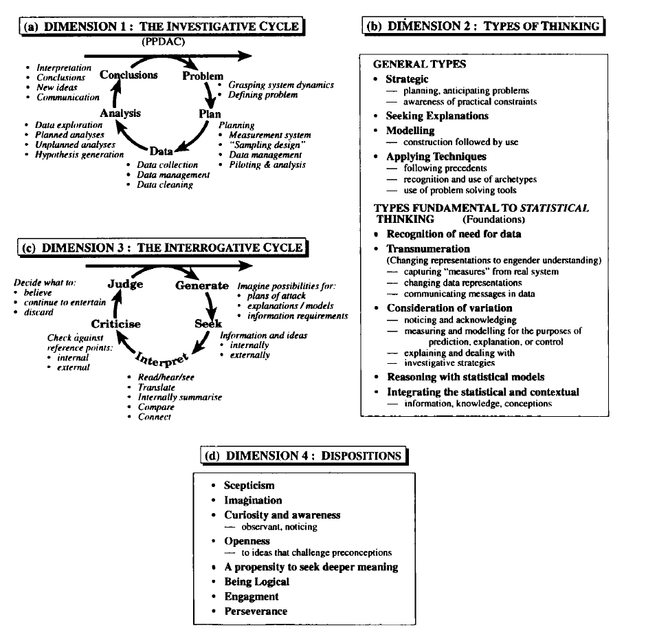

```{r setup, include=FALSE}
knitr::opts_chunk$set(echo = TRUE, fig.align="center")
```

> *Statistical thinking is the statistical incarnation of common sense.* ~ Wild & Pfannkuch

### In preparation for this lecture

Read *Novais, S., Evangelista, L. A., Reis-Júnior, R., & Neves, F. S. (2016). How does dung beetle (Coleoptera: Scarabaeidae) diversity vary along a rainy season in a tropical dry forest?. Journal of Insect Science, 16(1).*

### Summary

The main goal of this handout is to provide an introduction to the process of statistical enquiry. What is statistical enquiry, why is it important, and how do we approach it in a systematic way? We base our introduction on Wild and Pfannkuch's 4 dimensions of statistical enquiry, with special focus on the 1st dimension, the PPDAC investigative cycle (Problem, Plan, Data, Analysis, Conclusions).

### From practical questions to practical decisions

Every day of our professional and personal lives we are faced with practical questions and tasks. In order to function, we must be able to answer those questions and perform suitable actions, in essence, make decisions. And often those decisions have to be made in the absence of perfect information -- that is, in the presence of uncertainty.

Neither the practical questions nor the decisions we eventually make have anything to do with statistics per se -- statistics does not create questions and it does not make decisions. The role of statistics is in between the two -- to provide decision-making support for practical questions and tasks in the presence of uncertainty.

Here are a few practical questions/tasks:

* How does dung beetle diversity vary along a rainy season in a tropical dry forest? (see *Novais, S., Evangelista, L. A., Reis-Júnior, R., & Neves, F. S. (2016). How does dung beetle (Coleoptera: Scarabaeidae) diversity vary along a rainy season in a tropical dry forest?. Journal of Insect Science, 16(1).*)
* Does unequal housework lead to divorce? (see *Ruppanner, L., Brandén, M., & Turunen, J. (2018). Does unequal housework lead to divorce? Evidence from Sweden. Sociology, 52(1), 75-94.*)
* Where's the stock price going to be at tomorrow?
* How good are courses and teachers at FRI?
* Which predictive model should I use on my dataset?

Throughout the course we will emphasize the following: Transitioning from practical questions, which are more often than not vague and ambiguous, to statistical questions, which need to be precise, is a difficult task. The same is true for transitioning from the results of statistical analyses to practical decisions. In fact, there is no recipe and it can never be done perfectly! This makes the work of an applied statistician very challenging but also very exciting and creative!

Our view on statistical enquiry and how we try to teach it leans heavily on the work of Wild and Pfannkuch (1999) and their four dimensions of statistical enquiry: the investigative cycle, types of thinking, the interrogative cycle, and dispositions. In the remainder of this text we will introduce these dimensions and relate theory to practical examples.

<center>
{width=100%}
</center>

### Dimension 1: The PPDAC investigative cycle model

PPDAC stands for Problem, Plan, Data, Analysis, and Conclusions. It is a model of the statistical enquiry workflow -- what we think about and do at a particular stage of the investigative process. Note that this model was adopted by Wild and Pfannkuch from the earlier work of MacKay and Oldford.

PPDAC assumes that the statistical investigation is grounded in a practical problem. The Problem stage is concerned with translating the practical problem into an idealized statistical problem and the Conclusions stage in translating the analysis results into conclusions and ideas and communicating them to the decision maker. The in-between stages are concerned with Planning the data collection and analyses, collecting and cleaning the Data, and finally the Analysis.

PPDAC is a cycle because statistical investigation is an iterative proces. New findings and ideas in the Conclusions stage effect how we view the problem and may lead to new questions that we investigate in the next iteration. In practice it is not uncommon even to move back from one of the earlier stages, in particular, if we realize that we've made a mistake. For example, during the Data stage it might turn out that respondends interpreted a question in a way that we did not anticipate, so we have to move back to the Planning stage and redo Data collection.

Statistical enquiry always has all five stages of PPDAC. Sometimes so little attention is given to a stage that it may appear that it was not necessary, but rest assured that that is not the case. It is possible, however, that we only operate in a subset of the stages. For example, if we participate in a Kaggle predictive modelling competition the data would typically already be collected and the Conclusions stage simplifies down to reporting the predictions.

Now we'll look at each of the five stages of PPDAC in more detail.

#### Problem

In the beginning, the problem is often poorly defined and not suitable for quantitative analysis. Those that pose the problem and will make the final decision (henceforth *clients*) often have very vague ideas about what their problems are, what they need to understand, and why.

The Problem and Plan stages are about turning these vague ideas into more precise and actionable questions that we can answer using data. In the Problem stage we determine an idealized version of the problem (we may think of it as the best we could possibly do), while the Plan stage aims at developing a practical plan that is as close to the idealized version as it is practically feasible.

The Problem stage allows for a relatively systematic approach:

1. First, we determine the **units** and **target population**. The target population is the entire collection of units that we would like to investigate. The target population and units are just applied statistics terms for *data generating process* and *realizations/observations* from that data generating process.

> **Example -- Dung beetle variability**: It is clear from the paper that the authors' unit of interest was a dung beetle (*Coleoptera: Scarabaeidae*). Identifying the target population requires a bit more effort. While we can't really know what the authors were thinking, we can typically extract all the necessary information about the target (in other words, idealized) population from the conclusions the authors attempt to draw. In the Conclusion the authors speak about their findings in the context of a wet season in a tropical dry forest. It follows that their target population are dung beetles in any tropical dry forest in the world during any wet season (this year's, past, or future). Here we just assume that wet season and tropical dry forest are well defined terms. Despite analyzing just 3 periods of a single wet season and in just one location, the authors are generalizing their findings to all wet seasons of every tropical dry forest. Such generalizatios and this stark contrast between what we would like to do and what we are able to do in practice is an integral part of statistical enquiry. And it is the difference between the idealized Problem and the practically feasible Plan, as we will discuss in the Plan stage section.

2. Next, we determine the **variates** -- the characteristics of the unit that we are interested in and we can quantify. Some authors further divide variates into **response variates** (variates of primary interest) and **explanatory variates** (other variates related to the units of measurement that play the secondary role of explaining some of the variability in the response variates). Identifying and dealing with explanatory variates is an important part of the Plan stage.

> **Example -- Dung beetle variability**: The one and only response variate in this case was clearly the *species* of the dung beetle -- the authors' main interest being species variability. The time during a wet season is an example of an explanatory variate. The authors are also interested in seasonality. Geographical location arguably also might have an effect on dung beetle variability -- the authors do not explicitly state this variate, but as we will se later in the Plan stage, they do restrict the value of this variate to a specific location.

3. Next, we determine the **population attributes** -- summaries of the characteristics target population that we are interested in. In more theoretical language, functionals of the data generating process. These are typically numerical and sometimes visual.

> **Example -- Dung beetle variability**: The functional of interest in this case is variability of dung beetle species. We would probably agree that this phenomena of species variability exists, but there are different legitimate ways of defining it. Hence, there might be different legitimate ways of doing this statistical enquiry. For now, we leave it as a vague term and during the Plan precisely define what such vague terms mean in our enquiry.

4. Finally, we determine the **aspect** or statistical nature of our problem. There are 3 types of problems: *causative*, *predictive*, and *descriptive*. Identifying the aspect(s) of our problem is key for desigining an appropriate Plan and Analysis. Descriptive problems are the easiest -- we are only interested in estimating the properties of the population (for example, mean age of the working population). Predictive problems are, as the name suggests, concerned with predicting some variates from other variates (for example, can we predict the age of a worker from their salary). Causative problems are concerned with causal relationships -- how a change in variate (everything else being the same) would influence another variate (for example, it is clear that salary does not have a causal effect on age -- increasing a person's salary will not make them older; and, even if we can predict salary from age, that does not apply that simply being older results in a higher salary -- there might be a *confounding* variable that affects both, such as work experience or productivity). Causative problems are the most difficult type of problem and great care must be taken when designing the experiment. Interpreting results as if they were a proper causative analysis, despite only being a predictive analysis, is one of the most common and serious mistakes in applied statistics.

> **Example -- Dung beetle variability**: The aspect of the problem is predictive -- the authors are interested not only in estimating properties of the variates, but also in the relationship between species diversity and sesonality. The authors conclude that the beetle life cycles and the seasonality of environmental conditions are strongly synchronised, which is acceptably far enough from suggesting a causal relationship. Not that a causal relationship does not exist, but the way the analysis was conducted cannot support such a claim -- we will discuss this in more detail in the example sections of later stages of PPDAC.

#### Plan

> *Real statistics is less about the pursuit of the "correct" answer in some idealistic sense than about doing the best one can within constraints.* ~ Wild & Pfannkuch

The Problem stage results in an idealized formulation of the problem. In the Plan stage it is now time to design a practically feasible plan to investigate the problem. Rarely do we have the luxury that the idealized plan can be executed in practice without compromise. In fact, it is very common in statistical enquiries that the practical plan is very far from the ideal! Practical limitations cannot be avoided, however, we must always be aware of the compromises we made and how the errors we introduce might affect our conclusions, when we use practical results to reason about idealized problems.

The Plan stage is about deciding on two things (a) *what* we are going to measure and (b) *which entities* (people, objects) we are going to collect measurements for and *how* are we going to collect them.

Again, we can proceed in a relatively systematic manner:

1. First, we determine the **study units** and **study population**. These are analogue to the idealized *units* and *target population* but narrowed down to what we can actually investigate in practice. The difference between the study population and target population results in **study error**.

> **Example -- Dung beetle variability**: In the Problem stage we identified the target population as all dung beetles in dry rain forests during any wet season ever. The study population, however, is much narrower -- dung beetles during the beginning, middle, and end of the 2009-10 wet season in northern Minas Gerais state, Brazil. How can we make such a leap -- doesn't this huge discrepancy mean that the authors' research is useless? No! It might be a small piece of the puzzle, but, for now, it is a piece. But we mustn't forget this discrepancy and we must be critical of the authors if they later make generalizations without carefully considering the potential impact of study error. 

2. Next, we determine the **response variates to be measured**. Ideally, these would be the idealized **response variates** from the Problem stage, but that is not always possible. It might be infeasible to measure the idealized variate and we instead use a proxy (for example, body fat % is relatively difficult to measure, so we might use a combination of height, weight, and age as a proxy) or the idealized variate might not be precisely defined, so we need to introduce an operational equivalent (for example, academic performance is a phenomenon and students' average grades are one possible an operationalization of that phenomenon).

> *Operationalization: The process of defining the measurement of a phenomenon that is not directly measurable, though its existence is implied by other phenomena.* ~ Wikipedia

Using a proxy of course results in **approximation** or **proxy error**, which must be taken into account when interpreting the results. Often we can estimate this error and account for it. For example, a lot of research has been done on how good a proxy BMI (Body Mass Index) is for body fat %.

The operationalization we choose might also have an effect on the results. Because many different operationalizations are typically acceptable, the best we can do is justify our choice and potentially verify the robustness of our results to different operationalizations. For example, mean grade, maximum grade, relative grade, or number of attempts to pass exam are also legitimate operationalizations of academic performance.

> **Example -- Dung beetle variability**: In the Problem stage we identified beetle species as our response variate. This is well defined and not that difficult to measure, so we do not need to operationalize it or use a proxy. Instead, our ideal and measured response variate are the same. At this point we can again discuss the population attribute of interest -- the authors chose alpha-diversity (the number of different species), beta-diversity (the ratio between the number of different species in all areas combined over the number of different species in a plot), and abundance (total beetles). Is this a sensible operationalization of diversity? Can we think of another?

3. Next, we have to **identify** and **deal with explanatory variates**. At this point we should do our best to list all possible explanatory variates which might explain the variation in our response variates. Here we also need to deal with operationalization and potential use of proxies, but in that respect, explanatory variates are no different to response variates. What is different is that we get to choose how to treat each explanatory variate. We can (a) *ignore it*, (b) *fix it to some constant or range*, or (c) *vary it for each unit in the sample*:

    a. It is only safe to ignore an explanatory variate if we know that it does not explain any meaningful variation in the response variates. Failing to identify an important explanatory variate may lead to errors in our conclusions.

    b. By fixing it to some constant or range we in essence restrict the study population.
    
    c. Only by varying it we may explore the relationship between the explanatory variate and the response variates. There are two types of approaches to this: *experimental* and *observational*. In an observational approach we do not deliberately manipulate the explanatory variates, we only measure them. In an experimental approach, we deliberately assign values of explanatory variates to units.
    
An example of an experimental approach would be to make pizza dough with different levels of hydration (ratio between water and flour) in order to investigate the relationship between hydration and how much we like the dough. An observational approach would be to go to different pizzerias enquire about the hydration they use and taste their pizza. This example also illustrates the difference between dependency and causality. If use an experimental approach and we vary only the hydration level, we can conclude that it has or hasn't an effect on how much we like the pizza. If we use an observational study, we may not conclude that there is a causal relationship even though the data might be the same -- there might be a confounding variable, such as that pizza places that use certain hydration level also use flour that we like more or bake in a certain type of oven that results in better dough.

> **Example -- Dung beetle variability**: We will focus on explanatory variates that the authors explicitly included in their enquiry and those that they included implicitly. We will not discuss explanatory variates that were not included, but the reader should, as an exercise, think about other variates that the authors did not include but could affect the response variate. The authors explicitly include explanatory variates such as percipitation, plant richness, and plant abundance. These are dealt with using option (c) and in an observational fashion. That is, we allow them to vary but we measure them per unit (or at the time of the observation of the unit). Of course, it is practically impossible to measure these variables in an experimental fashion -- for example, we can't keep everything fixed and just make it rain more or add more plants. The authors also include two explanatory variates implicitly, without talking about them. These are geographical location and temporal location (time). In the beginning of the Plan stage we said that the authors use a narrower study population compared to the ideal target population. They should but don't state this explicitly. Now we can be more specific -- geographic and temporal location are explanatory variates and the authors choose to fix geographic location to 10 plots in the more or less same geographical location and observe temporal location only at three points of the same years' wet season. Thus they implicitly limit the study population.


4. Next, we have to **determine the measuring process**. That is, we need to determine how we will measure the variates of interest and once we determine the measuring devices, we need to, if possible, quantify *measurement error* -- the difference between the value of the measured value of the variate and the true variate. We should already be familiar with the two components of **measurement error**: *measurement bias* and *measurement variability*. Measurement error is propagated throughout all subsequent stages to the conclusion. Note that study error and approximation error also have a bias component and a variance component.

> **Example -- Dung beetle variability**: The authors choose to measure beetle species -- the only response variate -- via identification by an expert, using taxonomic keys. Reliability of this is not discussed but it seems reasonable to assume that it can be done with near perfect accuracy. The authors do not explain in the paper how plant richness and plant abundance were determined (they refer to another paper). And precipitation (mm) data was taken from the Mocambinho Meteorological Station, which we can also assume is the gold standard. 


5. Next is **the sampling protocol** -- the procedure used to select units from the study population to be measured. That is, how, when, and how many units do we select from the study population. Of course, the goal is for the sample to be as representative of the study population as possible in the context of the attributes of interest. Rarely are we able to measure all the units in the study population, so we will introduce **sampling error**. Sampling error, like other errors, can be divided in to sampling bias and sampling variability.

> **Example -- Dung beetle variability**: The authors sampled the beetles in 10 different locations, each with 4 pitfall-type insect traps with 50 grams of human feces hung from a wire above the trap opening used as bait. The traps remained in the field for 48 hours. There are many arguments here as to why this is far from a representative sample from the study population. We will discuss only two but we encourage the reader to discuss others. First, in order for this to give a representative sample, it must hold that a dung beetle's probability of ending up in the trap is independent of beetle species, time, location, weather, and any other variate. For example, can we assume that all dung beetle species are equally attracted to human feces? And second, the beetles caught in the trap died and were effectively excluded from the study population. One could argue that the beetles caught in the trap were only a small fraction of all beetles, but if that is the case, it then becomes very likely that there was more diversity, the beetles of some species just didn't get caught, because there are so few! The results (ten times more beetles caught in December) further emphasises this problem -- what if more diversity in December is only due to catching only a small fraction of the population and the immediate consequence that less abundant species would not appear at all? The authors make no attempt to discuss these or any other potential problems which could result in a biased sample.

6. Finally, we must devise the **data collection protocol**. This is the practical procedure for executing the Plan and includes the management, administrative issues, and a plan for data collection and quality control.

> **Example -- Dung beetle variability**: The authors do not discuss their data colleciton protocol. While it is not expected from such research papers to describe the management and administrative aspects of data collection, a few words about data collection and quality control should have been provided.

#### Data

After we have devised a plan, we can proceed with data collection. First and foremost, this stage is about **executing the Plan**. Things we should also consider are **data monitoring**, **data examination**, and, finally, **storing the data for further use**. Data monitoring is concerned with monitoring the data as they are measured to ensure their quality and to make changes to the Plan if necessary. Data examination is a preliminary examination of the data to check for internal consistency (measurements of related variates should be correlated, etc.) of the data and any patterns that suggest that there might have been a problem with data collection. If such patterns are found, we might opt to revise the Plan and/or redo data collection. Alternatively, we may proceed with Analysis, but keeping these findings in mind when further analyzing the data and drawing conclusions.

> **Example -- Dung beetle variability**: The authors do not discuss any parts of the Data stage and it is safe to assume that they did not consider any type of data examination before analysis.

#### Analysis

Next, we finally have the Analysis stage, the stage where we build a statistical model (or models) for the process that generated our data (according to choices in the Plan and Data stages), fit and assess the model, and use the results to address the Problem. In applied statistics courses (and machine learning courses in particular), we focus most of our attention on this stage, but unjustly so. We have seen from the previous three stages that many mistakes can be made (and indeed often are) before we even collect the data. If the Data are not collected correctly or, which is even worse, if the Plan does not follow the Problem or the Problem does not reflect the actual practical problem, then no amount of analysis will lead us to the correct conclusions. As such, the preceeding stages are equally if not more important as the Analysis stage!

However, it is true that the Analysis stage is the most rich in terms of the different models and techniquest that we can learn and use. We will still dedicate a substantial portion of the chapters that follow to different modeling methodologies. But for now we will just highlight the most funamental properties of the Analysis stage.

First and foremost, like the investigative cycle, the Analysis stage itself is an inherently iterative process. We postulate a model, we fit the model, and we assess the model. Then we use the assessment to refine the model and repeat the process until we are satisfied with how the model reflects the data generating process or at least the aspects of the data generating process that we are interested in. We can then use the final model to estimate the parameters of interest which can in turn be used to address the Problem.

> **Example -- Dung beetle variability**: The authors used a generalized mixed-effects model to estimate the relationship between the response variates ($\alpha-$diversity, $\beta-$diversity, and abundance) and the explanatory variates (plant richness, plant abundance, and month). They used a standard (non-Bayesian) framework. We will not discuss any of the details. Throughout this course we will develop a much better understanding of the Analysis stage.

#### Conclusions

In this fifth and final stage we report our results in a simple and effective way (avoiding statistical terminology, if possible) and interpret them in the context of the Problem. In this stage we should also report and discuss all potential sources of error that we've identified in the Plan, Data, and Analysis stages.

> **Example -- Dung beetle variability**: The authors make several claims in their Discussion and Conclusions. Here, we state just the most important conclusion: *Results suggest strong synchronism between the life cycle of these organisms and the seasonality of environmental conditions throughout the year, where the onset of the rains determines adult emergence in most species in the TDF studied.* The part *the onset of the rains determines adult emergence in most species in the TDF studied* does address the Problem of how dung species diversity varies and it does so in the simple language of the Problem -- adults of most dung beetle species emerge with the onset of the rains. The part *suggest strong synchronism between the life cycle of these organisms and the seasonality of environmental conditions throughout the year* is a far more general conclusion -- is it justified by the results? The authors do not discuss potential flaws in the study and we leave it to the Reader to decide whether or not this conclusion is valid given the issues we have pointed out in the previous stages.

### Dimension 2: Types of thinking

#### General types of thinking in a statistical context

**Strategic thinking:** Deciding what we will do and how we will do it. This includes the basic principles such as planning, breaking down tasks into subtasks, resource management, anticipating potential problems, risk management, and being aware of the constraints of the problem and taking them into account when making decisions. 

A particular type of constraint in statistical enquiry is that statisticians typically work on problems owned by someone else -- a *client*. The problem must be defined and planned with the client, major decisions must be cleared with the client, the client is often the main source of domain-specific knowledge, and it is imperative that the client is satisfied with our work. As such, *communication skills* and *psychology* play an important role.

**Modelling:** Using models to understand and predict behavior of phenomena is a very general way of thinking. By *model* we are the context of statistic most commonly referring to statistical models, such as linear regression. However, in the context of this dimension, we are referring to models in the more general sense that includes not only models we use for analysis, but also those in the stages of the investigative cycle. For example, the models we use for sampling, survey design, etc.

Note that all models are simplifications of reality, because information must be discarded in order to keep them at a manageable complexity. Of course, we aim for practically useful models -- models where we do not discard information that is relevant to what we are interested in.  

**Applying techniques:** A basic problem solving technique is to map a our problem to a problem that has already been solved, so that we can use or adapt an existing technique. In order to do this effectively, we must be able to *recognize problem archetypes* and corresponding techniques, *apply* those techniques, and correctly *interpret* the results.

#### Types fundamental to statistical thinking

**Recognition of the need for data** and not relying on personal experiences or anecdotal evidence.

**Transnumeration:** Statistical enquiry is based on obtaining data and then changing representations of that data to arrive at a better understanding of the phenomenon we are studying. This includes everything from simple summary statistics or representing the data visually to using a statistical model. Wild and Pfannkuch refer to this as transnumeration -- a dynamic process of changing representations to lead to understanding.

**Variation:** The main role of statistical enquiry is to support decision making under uncertainty. Uncertainty is often the consequence of variation -- slight changes in conditions. Therefore, statistical thinking includes identifying variation, measuring it, modeling it, and explaining it.

**Context knowledge, statistical knowledge, and synthesis:** Statistics is never done in a vacuum and one cannot indulge in statistical thinking based only on statistical knowledge and not context knowledge. We must synthesize context knowledge and results we obtain from data using statistical knowledge.


### Dimension 3: The interrogative cycle

The **interrogative cycle** is a generic thinking process that is in constant use in statistical problem solving. It is composed of five stages and statistician is, while performing statistical enquiry, always in one of them:

* **Generate** new possibilities.
* **Seek** information on those possibilities.
* **Interpret** -- process the information and integrate with our existing mental models.
* **Criticise** the information, by checking for internal consistency and against external reference points.
* **Judge** what information we keep, what we discard, what we now believe, what remains a possibility.

The result of this process is a *distilling and encapsulation* of information and ideas. That is, we extract the essence from the inputs and discard distractions and detail.

The Interrogative cycle is present at all levels, from macro to micro. For example, the problem can be trying to find a suitable statistical model for our data. First, we generate possible sources of that information (papers, experts), then we gather information from those sources, read/listen to it and integrate it with our current understanding of the problem. Then we critically view that information and finally we make a choice.

At a more micro level the problem might be trying to find an alternative confounding explanation for a relationship between two variates. First, we would generate possible alternative explanations, then we would seek information about them, interpret the information, and provide a critical view. Finally, we would judge which alternative explanations are suitable and which are not.

Note that an interrogative cycle can be and often is nested withing another interrogative cycle. For example, if we are concerned that a piece of information from a paper that we are using to address the current problem might be incorrect, we initiate another interrogative cycle that focuses on that question.

### Dimension 4: Dispositions

The 4th and final dimension of statistical enquiry are **dispositions** -- inherent personal qualities that are essential to statistical enquiry:

* **Curiosity** and **Awareness**: The goal of statistical enquiry is to discover new information that is relevant to our practical problem. And the best way to discovering new things is by being observant of what is going on and being curious enough to wonder why things are the way they are.

* **Imagination:** Statistical enquiry is a deeply imaginative process! To get to a statistical model we must first form a mental model of the problem, we must imagine possible explanations of the relationship between variates and even imagine unobserved variables that could lead to plausible alternative confounding explanations.

* **Scepticism:** To be on the lookout for flaws when receiving new ideas and information. Is the sampling procedure biased? What is the measurement error? How good are the data? Is the proposed model appropriate? Can we really make that conclusion from these results? These and other *worry questions* are essential not only when using or analyzing the work of others but also our own work.

* **Being logical:** The ability to see when one thing follows from another or not. And to be able to construct a logical argument to support our claims.

* **A propensity to seek deeper meaning** and not just taking things at face value. In particular, **openness** to new ideas even though they might be in conflict with our own view and **preserverance** -- doing something even though we know that success will be difficult to achieve and will take a long time to achieve.

* **Engagement:** When we are interested in a problem, that usually has a positive effect on all other dispositions.

Clearly these dispositions are important not only to statistical enquiry but to all creative intelectual endeavors. Some of them will come more naturally to us and others less. Regardless, we can always improve if we put in a conscious effort!

### Readings

* Wild, C. J., & Pfannkuch, M. (1999). Statistical thinking in empirical enquiry. International statistical review, 67(3), 223-248.

* MacKay, R. J., & Oldford, R. W. (2000). Scientific method, statistical method and the speed of light. Statistical Science, 15(3), 254-278.
