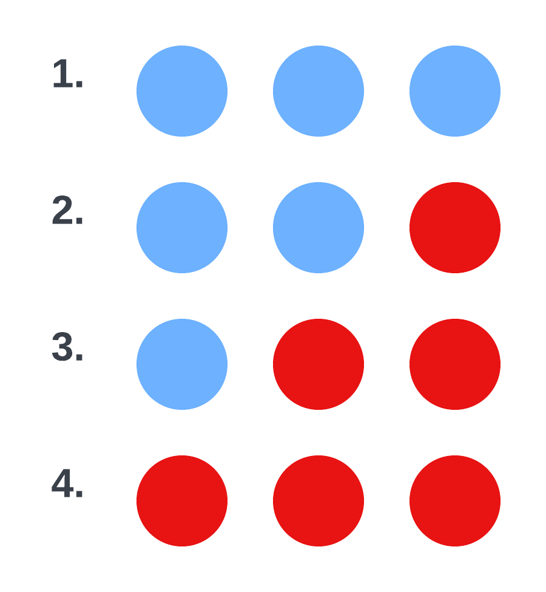
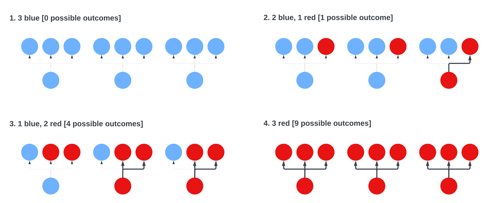

```{r setup, include=FALSE}
knitr::opts_chunk$set(echo = TRUE, fig.align="center")
```

### In preparation for this lecture

* Revise the definition of probability.
* Revise the pmf/pdf, support, parameters, mean, and variance for all univariate distributions from Principles of uncertainty (<https://fri-datascience.github.io/course_pou/probability-distributions.html>). You should also have an rough understanding of the shapes they can take.

### Summary

*Uncertainty refers to epistemic situations involving imperfect or unknown information.* ~ Wikipedia

The main goal of this handout is to illustrate how uncertainty is part of our everyday lives but in order to deal with it in a systematic way we require the rigor of probability theory. The language of probability theory allows us not only to express uncertainty but also to provide probabilistic interpretations of processes of interest, which then allows us to infer their properties from the data they generate. That is, probability theory is the very foundation of applied statistics.

### Statistics is just counting

A very good definition of statistics states that

> *Statistics offers us a framework for reasoning in the presence of uncertainty.*

The fact that uncertainty is almost omnipresent makes statistics one of the most important sciences out there. Even though a lot of what we will do is fairly complex, the main idea is quite simple -- outcomes that can occur in many different ways are more probable than the ones that cannot occur in so many ways. In other words, statistics in its essence is mainly counting.

This concept can be explained through a simple example. Let us say that we have a bag with 3 marbles in it, the marbles are of two colors -- red or blue. We draw 2 marbles with replacement and they are both red. Our statistical task now is to figure out what is in the bag. There are 4 options:

<center>
{width=20%}
</center>

To get to the bottom of this, we have to simply count the number of ways each of the above bags can generate our dataset (2 red marbles). This process is visualized on the figure below.

<center>
{width=100%}
</center>

So, with the first option (3 blue marbles) we cannot generate our dataset (2 red marbles). In the second case, we can generate it one way, in the third case we can generate it in 4 different ways and in the fourth case, we can generate it in 9 different ways. The fact that we can generate our dataset in the most ways with the last options makes it the most plausible. But not the only one possible! Below are probabilites about what can lie in the bag, getting the probabilities is quite simple, we divide the number of ways a given option can generate the dataset with the amount of ways that all possible bags can generate the dataset ($1 + 4 + 9 = 14$)

1. P(3 blue) = 0
2. P(2 blue, 1 red) = 1/14,
3. P(1 blue, 2 red) = 4/14,
4. P(3 red) = 9/14.

Counting is of course unfeasible with more complex problems, but the rationale remains the same there. As you will see later on we will use Markov Chain Monte Carlo to generate plausible solutions to our problem and in the end we will do the counting on these plausible solutions.

### Uncertainty in everyday life

We begin with the results of a survey we did with 30 participants where each participant was asked to assign a percentage probability to each of several common expressions that we use to express uncertainty. Each dot in the figure below represents one participant's probability assignment and the numbers in red the average across all participants for that expression:

<center>
{width=70%}
</center>

Note that the survey was in Slovenian and some bias might have been introduced in translation, but the results are more than sufficient for the arguments we are trying to make. First, our natural language obviously already contains expressions that serve the purpose of expressing uncertainty. And there are few better indicators of the importance of something than that it is an integral part of our language.

Second, the participants probabilistic assignments are relatively similar. For example, there is a consensus across all participants that *very likely* implies a higher probability than *unlikely*. And for most expressions the range of assignments is relatively limited. These similarities are of course essential for communication to function.

Third, while similar, the probabilistic assignments are imprecise, they vary across participants and arguably even for the same participant over time and context. For example, the probabilistic assignments for *unlikely* vary from 5% to 60%. And the assignments for *maybe*, although most are at 50%, vary from 0% to over 60%. Further discussion revealed that for some participants saying maybe (for example, as a response to the question *Are you coming to our party?*) is an expression of curtesy and actually means no or probably not. To complicate things further, it depends on who says *maybe* and their history of then doing the thing in question or not.

Fourth and finally, the expressions in the survey are limited to yes/no questions. When faced with more than two options, we lack specialized expressions and we typically resort to ordering or assigning a yes/no expression to each option. Things are further complicated when there is an infinite or even uncountable number of options, for example, *What will the temperature be tomorrow?*. In such cases we typically resort to approximate (for example, *Between 24 and 26 degrees.*) or vague answers (for example, *Around 25 degrees.*).

Based on the above we argue that uncertainty is part of our everyday lives. And while natural language is *good enough* for most everyday situations, it is not appropriate for precise, unambiguous, and generally applicable expression of uncertainty. And, as is always the case where such requirements are set, we have to resort to mathematics for an answer.

### The language of probability

Probability theory provides us with mathematical objects for describing uncertainty and with mathematical tools that allow us to manipulate these objects in a coherent way. For example, take the Bayes theorem that is at the core of all Bayesian statistics:

$$p(\theta|y) = \frac{p(y|\theta)p(\theta)}{p(y)}.$$

Or the posterior mean of the parameter $\theta$:

$$E[\theta|y] = \int \theta p(\theta|y)d\theta.$$

We can get by as applied statisticians even if we do not have the level of mathematical knowledge that allows us to do computation such as deriving the above expressions for some choice of model $p(y|\theta)$ and prior $p(\theta)$. In fact, in this course we will emphasize the use of computational tools such as Markov Chain Monte Carlo. We do, however, require a good conceptual understanding of basic probability, in particular, the various distributions that are used in statistical modelling and how they relate to each other.

In this section we will briefly review the definition of probability, motivated by the need to describe uncertainty in a formal way.

Uncertainty arises in situations where we have multiple possible options and we are not certain which of them is true. For example, will it be sunny tomorrow, or will it rain, snow, or something else? At a minimum, we need to list these options and that is the role of the sample space $\Omega = \{\text{rain},\text{snow},\text{sunny},\text{other}\}$ also known as the set of outcomes.

For a precise definition of probability, we need to specify what will be a valid probabilistic question. That is, what will we be assigning probabilities to. It is tempting to say that we will only be assigning probabilities to individual outcomes $\omega \in \Omega$. The problem is that this is too restrictive. For example, we are allowed to say $P(\text{snow})$ but not the complementary $P(\text{not snow})$ or the union $P(\text{rain or snow})$, or even the most basic impossible event $P(\emptyset)$. The inclusion of the empty set, complements, and unions of elementary outcomes leads us to the power set or, in general, a sigma-algebra of the set of outcomes $\mathcal{F}$ - also known as the set of events. We will be assigning probabilities to events. Note that outcomes are also events.

Finally, we arrive to the definition of probability. We start with a function that maps from the set of events to the set of real numbers $P: \mathcal{F} \rightarrow \mathbb{R}$. However, in order for this function to be a probability it must satisfy the additional restrictions of (i) being non-negative, (ii) P($\Omega$) = 1, and (iii) countable additivity. That is, the axioms of Kolmogorov. Axioms (i) and (ii) can be justified with the intuitive notion of a certainly false (impossible) and certainly true events. Every event is at least as probable as the certainly false event and at most as probable as the certainly true event. Or, in other words, nothing can be more false than something that is false and nothing can be more true than the truth. Axiom (iii) deserves more attention that we can afford to give it here. We will only partially motivate it by the special case of two disjoint events $A$ and $\overline{A}$. From countable additivity it follows $P(A) + P(\overline{A}) = P(A \cup \overline{A}) = P(\Omega) = 1$. Without countable additivity the union of two events could be more or less than 1. Lack of this structure would prevent us from deriving any general properties of probability.

This concludes the minimum probability theory that we need to use it as a language to describe uncertainty. We only have to make sure that our statements adhere to these axioms. That is, don't claim probabilities less than 0 or more than 1 and make sure that probabilities of disjoint events sum to the probability of their union. Of course, this becomes more difficult when we have many, possibly infinitely or even uncountably many outcomes, but luckily we in practice rarely deal with probability spaces and probabilities directly. Instead, we use random variables and distributions, which by design adhere to the axioms of probability.

We can see that probability theory does not deal with the accuracy of the probabilities or if they even make sense! It only deals with the bare minimum that we need to agree on in order to understand what we are talking about. For example, it is perfectly coherent to say that the world will end tomorrow with 99.9% probability as long as you also think that the probability of the world not ending tomorrow is 0.1%.

### Sources of uncertainty

Before we proceed with random variables and distributions, let us for a moment turn our attention to sources of uncertainty. Due to how probability and statistics are typically introduced, through the notion of random experiments, coin flips, and die rolls, people are often under the impression that uncertainty only results from randomness. That could not be further from the truth. Parameters of statistical models are a great example. For example, when investigating the fairness of a coin we are interested in its probability $p$ of landing heads. Before we flip the coin, we do not know much about $p$. That is, there is some uncertainty regarding the value of $p$. But no one will argue that $p$ is the result of a random experiment -- it is an unknown constant.

Another example would be things that appear random because we do not have enough information. The most extreme example being the outcome of a pseudo-RNG that we use for our statistical analyses. For practical intents and purposes the output of such a RNG can't be distinguished from truly random sequences, even though it is deterministic. Therefore, we are uncertain about the next number and properties of the sequence, such as the mean, etc. However, if we knew the algorithm and the random seed, the sequence becomes deterministic and there is no uncertainty.

Finally, uncertainty also applies to events from the past, where there is arguably no randomness, just a lack of information. For example, did it rain on this exact same date 300 years ago in Ljubljana? One of the two options is clearly true - it eigher rained or it didn't. However, we lack records from that period, so there is no way of being certain. Even though the uncertainty is not the result of randomness, we can still say that we believe it rained with 0.05% probability or derive a probability from records from nearby locations, historical weather patterns, etc.

To summarize, uncertainty is the result of lack of information and that lack of information can be caused by mandy different things, not just the inherent randomness of the underlying process. Uncertainty also depends on the observer -- what is uncertain for one observer might be less uncertain or even certain to another observer.

In this course we will not pay much attention to the reasons behind our uncertainty, other than in cases where their nature might help us determine potential biases. We will, however, make a principled stand on uncertainty and probability:

**As Bayesian statisticians we choose to represent our uncertainty with probability.**

This is the fundamental stand of Bayesian statistics, which we will repeat a couple of times more. We use probability to describe our uncertainty, even though the object we are describing might be deterministic. And, as new evidence (data) comes along, we use it to update our uncertainty.

### Expressing uncertainty with uncertain quantities and their distributions

Let's return to our example of what the weather will be like tomorrow, where we are interested in the following options $\{\text{rain},\text{snow},\text{sunny},\text{other}\}$. And let's say that we believe that all four options are equally probable. We now have all the tools to express this uncertainty formally. The above is our sample space, the events can be the power set of our sample space, and, because we are dealing with a countable sample space, it suffices to say that the probability of all singletons in the event space (all outcomes) is $\frac{1}{4}$ and via countable additivity we already uniquely determine the probability of all other events.

The above example with a small finite set of outcomes is very simple and already there is a lot of work for expressing uncertainty. Things get unwieldy very quickly if we in the same manner try to formally specify the sample space and probabilities for infinite or even uncountable truths. For example, if we were expressing uncertainty in a count quantity, such as number of customers in our store in a day, we would have to specify them for 0 customers, 1 customer, 2 customers, etc. up to an arbitrarily high number. And for continuous quantities, such as temperature, we would have to resort to discrete approximations or defining a probability for every interval.

The above is not very practical, so instead of using the fundamental objects sample spaces and probability functions, we use more simple high level representations that are random variables and their distributions. A random variable is a bit of a misnomer, because it is neither random nor a variable (it is in fact a deterministic function). Instead, we will often refer to random variables as uncertain quantities -- a term which better illustrates their function. An uncertain quantity is a mathematical object that is used to represent uncertainty -- a lack of perfect information. Because we are not certain about the value of the quantity, we instead give it a distribution over possible values. Then we can proceed with computation as if the variable were deterministic, but, of course, and functions of random variables will again be random variables. That is, once we have uncertainty, that uncertainty will typically persist throughout our calculations.

And distributions are nothing but high level compact representations of probabilities, without the cumbersome definition of the underlying probability spaces. For example:

* If someone asks us if we are going to their party, we'd instead of maybe say that let $X$ be the binary uncertain quantity representing whether or not we will attend and $X \sim \text{Bernoulli}(0.5)$. Of course, this is not the approach we would use in actual social situations, because it for a lot of people wouldn't be clear what we are talking about. However, in applied statistics, this type of thinking and expression is indispensible.

* In the weather case we would label the options 1-4 and represent the weather situation with uncertain quantity $W$ and say that $W \sim \text{Categorical}([1/4, 1/4, 1/4, 1/4])$.

* In the count case we might assign the uncertain quantity of the number of customers $N$ a geometric distribution $N \sim \text{Geom(0.1)}$. As long as we agree on the parametrization of the geometric distribution, this is an unambiguous statement that we assign these probabilities:

```{r, out.width = "50%", echo = FALSE, warning = FALSE, fig.align="center"}
x <- seq(1, 50, 1) - 1
y <- dgeom(x, 0.1)
library(ggplot2)
ggplot(data.frame(x, y), aes(x = x, y = y)) + geom_bar(stat = "identity") +
  xlab("visitors") + ylab("probability")
```

* In the temperature case, we would treat the temperature as an uncertain quantity $T$ and if we, for example, wanted to express the opinion that it will be around 25 degrees, use a normal distribution $T \sim N(25, 3)$. Again, if we agree that we will parametrize the normal distribution with the mean and standard deviation, this is an unambiguous statement that we assign the following density (the area represents the probabilities):

```{r, out.width = "50%", echo = FALSE, fig.align="center"}
x <- seq(1, 50, 0.01)
y <- dnorm(x, 25, 3)
library(ggplot2)
ggplot(data.frame(x, y), aes(x = x, y = y)) + geom_line() +
  xlab("temperature") + ylab("density")
```

It is a very short step from formal probabilistic expression to probabilistic (statistical) modeling. For example, recall the earlier example with the number of customers. Let's say that we don't really know what the mean number of customers $X$ is and we would instead like to predict it from historical data. Instead of claiming $X \sim \text{Geom(0.1)}$ we have to replace the constant with parameter $\theta$ we would like to learn about $X \sim \text{Geom}(\theta)$. Do we know exactly what $\theta$ is? Of course not, if we did, there would be nothing left to learn. Not all is known about $\theta$ so it again makes sense to think about it as an uncertain quantity. As such, we need to express our probabilistic opinion about $\theta$ before we even see the data. In other words, we need to give it a distribution. Even having no clue about what $\theta$ might be is no excuse, because having no clue is also a valid probabilistic expression. For example, we might say $\theta \sim \text{Unif}(0,1)$.

This is a relatively simple example, but from this example to the most complicated parametric models, they are all just compositions of probabilistic expression. Of course, choice of distributions will vary from analysis to analysis and often even from one iteration of the same analysis to another. Choosing a sensible probabilistic interpretation of the process we study is both science and art and the topics of modeling and model selection will receive a lot of attention throughout the course.

### Recommended readings

* Kruschke, J. (2014). Doing Bayesian data analysis: A tutorial with R, JAGS, and Stan. Academic Press. (Ch02 - Credibility, Models, and Parameters; Ch04 What Is this Stuff Called Probability)

* McElreath, R. (2020). Statistical rethinking: A Bayesian course with examples in R and Stan. CRC press. (Ch01 - The Golem of Prague; Ch02 - Small Worlds and Large Worlds)

### Additional readings

* *If you are interested in learning more about the peculiarities of peoples' reasoning with uncertainty, this paper from the nobel laureates Tversky and Kahneman is a great starting point:* Tversky, A., & Kahneman, D. (1974). Judgment under uncertainty: Heuristics and biases. Science, 185(4157), 1124-1131.
