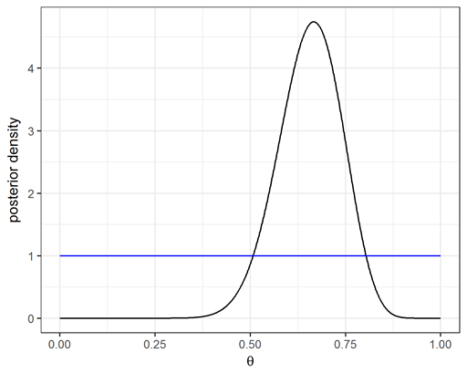
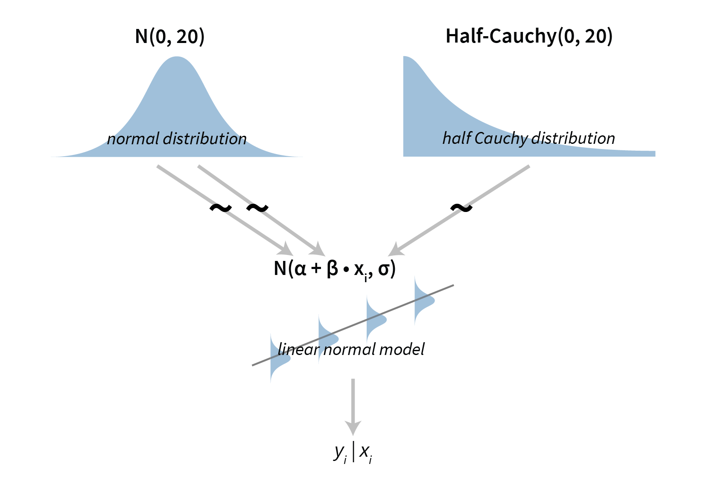

```{r setup, include=FALSE}
knitr::opts_chunk$set(echo = TRUE, fig.align="center")
```

# Summary

Statistical (probabilistic) models are used for describing how certain data we are interested in was generated. Probabilistic programming languages offer both a methodological way for specifying statistical models and tools for performing automated inferences on these models.

Stan is a widespread probabilistic programming language, it offers an intuitive framework for specifying statistical models along with algorithms for full Bayesian inference for continuous-variable models through Markov chain Monte Carlo methods such as the No-U-Turn sampler, an adaptive form of Hamiltonian Monte Carlo sampling.

# Statistical modelling

Statistical models are used to describe processes that are behind the generation of some data we are interested in. If we know what the process is, we know pretty much all there is to know about the generated data. Since the data generation processes are traditionally very complex and contain many unknowns, statistical models are usually just an approximation of this process.

A formal definition of a statistical model defines it as a pair of two sets ($\mathcal{S}$ and $\mathcal{P}$), where $\mathcal{S}$ is the set of possible observations, i.e. the sample space, and $\mathcal{P}$ is a set of probability distributions on $\mathcal{S}$. The intuition behind this definition is as follows. It is assumed that there is a "true" probability distribution induced by the process that generates the observed data. We choose $\mathcal{P}$ to represent a set (of distributions) which contains a distribution that adequately approximates the true distribution.

Note that we do not require that $\mathcal{P}$ contains the true distribution, and in practice that is rarely the case. Indeed, a model is usually a simplification or approximation of reality and hence will not reflect all of reality. Hence the saying *all models are wrong, but some are useful*. However, there is no modelling without a model!

In the previous lecture we said that as Bayesian statisticians we choose to represent our uncertainty with probability. In other words, we use probability to describe our uncertainty and evidence (data) to then update it. In Bayesian statistics the starting point is a probabilistic model and our prior opinion about the model's parameters. Next, we use Bayesian inference and evidence (data) to update our beliefs about these parameters.

Since you already listened to the Introduction to statistical learning and decision theory course all this should sound somewhat familiar to you. There you used the notation $h : \mathcal{X} \rightarrow \mathcal{Y}$ to denote a model (function), where $\mathcal{X}$ and $\mathcal{Y}$ represent the dependent (input) and independent (output) variable spaces, respectively. A learning algorithm $\mathcal{A}$ given a dataset thus produces a model $A(D_n) = h_n$. Let $\mathcal{H}$ denote the set of all possible models for a particular learning algorithm. In statistical modelling outputs ($\mathcal{Y}$) are not point estimates but probability distributions, meaning that $\mathcal{H}$ represents a family of probability distributions from which the model ($h$) is trained.

## The Bayes' rule

At the core of Bayesian statistics is the Bayes' rule:

$$p(\theta|y) = \frac{p(y | \theta) \ p(\theta)}{p(y)} \propto p(y | \theta) \ p(\theta),$$
where $p(\theta|y)$ is usually called the posterior, $p(y | \theta)$ the likelihood, $p(\theta)$ the prior and $p(y)$ the evidence. Luckily, we can get rid of the $p(y)$ component as it is hard to calculate. We can get rid of it because its main purpose is normalization and as such does not influence the shape of the posterior distribution. In other words, from the parameter's standpoint (we are interested in estimating the parameters) $p(y)$ is a constant.

To better understand the Bayes' rule let us write it down a bit more informally:

$$\text{(new beliefs)} \propto \text{(new data/information)} \cdot \text{(prior beliefs)}.$$

The informal equation above shows why Bayesian staticits is very intuitive, at its core is the same logic that we use to reason and update our beliefs in everyday lives. We update our beliefs about the world and the environment by merging previous (prior) beliefs with new data (information) that comes along.

Let us solidify this concepct through a simple example. Assume that we are an alien that just landed on earth and is interested in figuring out what proportion of earth is covered by water. We have a special device for doing this, we fire the device into the air, it lands on a random location on earth and lets us know whether it landed on earth or in the water.

```{r, warning = FALSE, message = FALSE}
# library
library(tidyverse)
library(ggplot2)
library(cowplot)

# x axis
x <- seq(0, 1, 0.1)

# water
water <- x * 2

# land
land <- 2 - water

# prior
prior <- rep(1, 11) / 11

# plots storage
plots <- list()

# plot our initial belief
df <- data.frame(x, prior)
p <- ggplot(df, aes(x, prior)) +
    geom_bar(stat = "identity") +
    xlab("Water percentage") +
    ylab("Belief") +
    ylim(0, 1)

# store
plots[[1]] <- p

# set posterior
our_belief <- NULL

saw_land <- function(our_belief, plots) {
    # calculate the posterior
    if (is.null(our_belief)) {
        posterior <- prior * land
    } else {
        posterior <- our_belief * land
    }
    posterior <- posterior / sum(posterior)

    # plot
    df <- data.frame(x, posterior)
    plot <- ggplot(df, aes(x, posterior)) +
        geom_bar(stat = "identity") +
        xlab("Water percentage") +
        ylab("Belief") +
        ylim(0, 1)

    return(list(posterior, plot))
}

saw_water <- function(our_belief, plots) {
    # calculate the posterior
    if (is.null(our_belief)) {
        posterior <- prior * water
    } else {
        posterior <- our_belief * water
    }
    posterior <- posterior / sum(posterior)

    # plot
    df <- data.frame(x, posterior)
    plot <- ggplot(df, aes(x, posterior)) +
        geom_bar(stat = "identity") +
        xlab("Water percentage") +
        ylab("Belief") +
        ylim(0, 1)

    return(list(posterior, plot))
}

# sample location from https://www.realrandom.net/location.html
# 11 samples gave us (1 - water, 0 - land)
y <- c(1, 0, 1, 1, 0, 1, 1, 1, 1, 0, 1)

for (observation in y) {
    if (observation == 1) {
        result <- saw_water(our_belief, plots)
    } else {
        result <- saw_land(our_belief, plots)
    }

    # update our belief and store the plot
    our_belief <- result[[1]]
    plots[[length(plots) + 1]] <- result[[2]]
}

plot_grid(plotlist = plots, ncol = 3, nrow = 4, scale = 0.9)
```

At the beginning we had no (prior) knowledge about what lies on the surface of the earth but as we got more and more data, our beliefs became more certain and got closer to the truth (~70%).

## A simple example

To get some feel about what statistical models really are, let us develop a simple Bayesian model. In this example we are interested in modelling a coin that when flipped lands either on its head (1) or its tail (0). We are interested in modelling the probability that the coin lands on its head, let us denote this probability with $\theta$. We observed 30 flips:

```
100100101011011001111111111101
```

, as you can see the flipping resulted in 20 heads (ones) and 10 tails (zeros). We will solve this problem analytically by using the Bayes' rule:

$$p(\theta|y) \propto p(y | \theta) \ p(\theta).$$
Or in our case:

$$p(\theta|n,z) \propto p(n,z|\theta)p(\theta),$$
where $z$ denotes the number of heads and $n$ the number of coin flips.

We will use the Bernoulli distribution to model the coin flipping process:

$$p(n,z|\theta) = \theta^z(1-\theta)^{n-z}$$

and we will use a beta distribution as our prior. The first reason for picking the beta distribution is that it forms a conjugate pair with the Bernoulli distribution, meaning that we can solve the problem at hand analytically. The second reason is that the beta distribution's support is [0, 1] which makes it handy for asserting any prior knowledge of parameters that are associated with probability. Our prior will be thus based on beta distribution's PDF:

$$p(\theta) = \frac{\theta^{\alpha-1}(1-\theta)^{\beta-1}}{B(\alpha, \beta)} \propto \theta^{\alpha-1}(1-\theta)^{\beta-1}.$$
If we insert the above Bernoulli likelihood and beta prior into the Bayes' rule we get:

$$p(\theta|n,z) \propto \theta^z(1-\theta)^{n-z} \theta^{\alpha-1}(1-\theta)^{\beta-1},$$

$$p(\theta|n,z) \propto \theta^{(z+\alpha)-1}(1-\theta)^{(n-z+\beta)-1},$$

$$p(\theta|n,z) \propto \beta(z+\alpha, n-z+\beta).$$
The only remaining thing we have to do is to plug our data ($n = 30, z = 20$) and our prior beliefs ($\alpha = 1, \beta = 1$, a uniform prior on the [0, 1] interval) in the equation above:

$$p(\theta|30,20) \propto \beta(20+1, 30-20+1) \propto \beta(21, 11).$$
The figure below visualizes how we updated our prior knowledge about the coin ($\beta(1,1)$, the blue line) after we saw the sequence of tosses listed above ($\beta(21,11)$, the black line).

<center>
  
</center>

# How can inferences be made programatically/automatically

The previous example is as simple as they come: it is a one-dimensional, single parameter model where the posterior and the prior distributions form a conjugate pair. As a result we can infer from the model in an analytical fashion. In practice however, this is rarely the case. What are our options if we cannot solve the problem analytically?

## Grid approximation (brute force)

One of the options at our disposal is grid approximation. We can approximate the posterior distribution by considering a finite grid of parameter values. We can easily calculate the posterior and any particular value of the parameter $p$, we just have to multiply the prior probability of $p$ by the likelihood at $p$.

```{r, warning = FALSE}
# libraries
library(ggplot2)

# set grid resolution
resolution <- 100

# create the grid
grid <- seq(from = 0, to = 1, length.out = resolution)

# prior
prior <- rep(1, resolution)

# sequence 100100101011011001111111111101
n <- 30
z <- 20

# likelihood
likelihood <- dbinom(z, n, prob = grid)

# posterior
posterior <- likelihood * prior

# standardize the posterior so it sums to 1
posterior <- posterior / sum(posterior)

# visualize
df <- data.frame(x = grid, y = posterior)
ggplot(data = df, aes(x = x, y = y)) +
  geom_bar(stat = "identity",
           color = "#67a9cf",
           fill = "#67a9cf",
           alpha = 0.5) +
  xlim(0, 1) +
  xlab("") +
  ylab("density") +
  theme_minimal()
```

Even though this solution looks good on paper it is rarely useful in practice. It's main issue is that, as the number of parameters increases, it scales really poorly. In real world models are often multi-dimensional, include several parameters and use distributions that are usually not conjugate. As a result, we cannot solve the model analytically or infer from it by using the grid approximation method.

## Markov Chain Monte Carlo

As it turns out, we can use Markov Chain Monte Carlo (MCMC) to solve the problems of the grid approximation approach in an efficient manner. Indeed, variants of MCMC are the core of all probabilistic programming languages for Bayesian inference. These algorithms require only two things, prior distribution has to be specified by a function that can be easily evaluated and the likelihood function ($p(D|\theta)$) can be computed for any specified values of $D$ and $\theta$. Actually, these methods only demand that the prior and the likelihood can be easily calculated up to a multiplicative constant. The code below estimates the $\theta$ parameter we are interested in by using the Metropolis-Hastings algorithm.

```{r, warning = FALSE, message = FALSE}
# libraries
library(ggplot2)
library(tidyverse)

# prior
prior <- function(theta) {
  dunif(x = theta, min = 0, max = 1)
}

# likelihood
likelihood <- function(z, n, theta) {
  dbinom(x = z, size = n, prob = theta)
}

# posterior is likelihood * prior
posterior <- function(z, n, theta) {
  likelihood(z, n, theta) * prior(theta)
}

# metropolis-hastings
metropolis <- function(z, n, steps = 1000, init = 0.5, step = 0.2) {
  # theta storage
  theta_posterior <- rep(NA, steps)

  # start
  theta_posterior[1] <- init

  for (t in 2:steps) {
    # propose next candidate value and clamp to 0..1
    theta_candidate <- theta_posterior[t - 1] + rnorm(1, 0, step)
    theta_candidate <- min(1, max(0, theta_candidate))

    # calculate ratio
    likelihood_candidate <- posterior(z, n, theta_candidate)
    likelihood_previous <- posterior(z, n, theta_posterior[t - 1])
    likelihood_ratio <- likelihood_candidate / likelihood_previous

    # decide to accept candidate value or to keep the current value
    accept <- rbinom(1, 1, prob = min(likelihood_ratio, 1))
    theta_posterior[t] <-
      ifelse(accept, theta_candidate, theta_posterior[t - 1])
  }

  # return the posterior parameter samples
  theta_posterior
}

# sequence 100100101011011001111111111101
n <- 30
z <- 20

# metropolis-hastings
chain1 <- metropolis(z, n)
chain2 <- metropolis(z, n, init = 0.25)
chain3 <- metropolis(z, n, init = 0.75)

# plot samples through time
df_samples <- data.frame(x = seq_len(length(chain1)),
                        theta = chain1, chain = "1")

df_samples <- df_samples %>%
  add_row(data.frame(x = seq_len(length(chain2)), theta = chain2, chain = "2"))

df_samples <- df_samples %>%
  add_row(data.frame(x = seq_len(length(chain3)), theta = chain3, chain = "3"))

# visualize
ggplot(data = df_samples, aes(x = theta)) +
  geom_histogram(bins = 50, color = "skyblue",
                 fill = "skyblue", alpha = 0.75) +
  xlim(0, 1) +
  xlab("") +
  ylab("density") +
  theme_minimal()
```

For illustrative purposes the above code is the most basic variant of the algorithm. In practice the implementations use a number of improvements, e.g. using log-likelihood for the purposes of numerical stability, adaptive configuration of the step size, etc. It is also worth mentioning that modern tools for Bayesian inference facilitate approaches that are more sophisticated than Metropolis-Hastings, such as the No-U-Turn Sampler (NUTS) in Stan. A detailed discussion about particular MCMC algorithms is outside of the scope of this course. If you are interested in these details you can find some good references here <https://chi-feng.github.io/mcmc-demo/>. Even if you are not interested in reading very demanding scientific papers, check out the neat sampling visualizations of MCMC sampling that can be found on that same page. To determine how the posterior is calculated we can use probabilistic models defined through probabilistic programming languages.

# Probabilistic programming languages

When we talk about programming languages we traditionally think about imperative programming. Indeed, the majority of programming languages that we use (e.g. Python, Java, R, C, C++ ...) are imperative. In imperative programming we are given a set of inputs (input parameters or input data) and our goal is to develop an algorithm (define a step-by-step procedure) that uses given inputs to produce desired outputs. Below is an example of a typical imperative algorithm.

```{r eval=FALSE}
# Generate n Bernoulli variables
bernoulli <- function(n, p) {
  # Create an empty vector
  x <- c()

  # Loop n times
  for (i in 1:n) {
    # Draw from uniform(1) and append 0 or 1
    if (runif(1) > p) {
      x <- c(x, 0)
    } else {
      x <- c(x, 1)
    }
  }

  # return the vector
  return(x)
}
```

A Probabilistic Programming Language (PPL) is a computer language designed to describe probabilistic models and distributions such that probabilistic inferences can be made programmatically. In other words, PPLs are programming languages designed specifically for developing probabilistic models and inferring from them. They enable us to focus on the modelling part while they take care of the mathematical and computational problems required for statistical inference. Probabilistic programming languages are based on algorithms developed in a traditional, imperative fashion. In other words, they are an interface that enables us to focus on defining models while they take care of everything else required in statistical modelling.

In probabilistic programming we are given a dataset and our goal is to describe the process that generated this data through a statistical model. The core of the model is composed of:

* specification of the input data,
* definition of the model,
* specification of prior information.

As you see we already developed a statistical model for the coin toss, let us write it down again, but this time in a more compact notation:

1. Specification of the input data:

$$y_1, ..., y_n \qquad y_i \in {0,1}.$$

2. The model:

$$y_1, ..., y_n | \theta \sim_{iid} Bernoulli(\theta).$$

3. Prior information:

$$\theta \sim Beta(1,1).$$

As you will see later on, this is basically all you have to do with probabilistic programming. Obviously coin tossing is a simple process which results in a simple statistical model, but the process is essentially the same even for extremely complex models.

With imperative (traditional) programming your task is to develop an algorithm (a set of steps) that generates some outputs based on given inputs. So we are developing a process that generates some data. With probabilistic programming we are going the other way, we are given the "output" (some data) and our task is to "reverse engineer" the process (or algorithm) that generated the data.

In the Bayesian setting a probabilistic program is a description of how to compute the posterior distribution. So, ironically a probabilistic model (a probabilistic program) is usually not something nondeterministic.

## All models are wrong, but some are useful

The problem we are solving with probabilistic programming is in its essence unsolvable, since there are usually infinite options to generate the given data and we have no mechanism to prove which of them is correct. So our task is not to develop a model that perfectly simulates the real data generating process, in practice such model would be probably to complex and as such useless. Our task is to develop a model that is an abstraction of the real process, meaning that the model is only a simplified interpretation of the real process. However, this model has to still model the real process accurately enough, otherwise it is just as useless as a too complex model. In a way we are again dealing with the bias-variance tradeoff, which is a very known problem in the machine learning world.

So it is important to be aware that you will probably never develop a perfect model. Probabilistic model development is an iterative process guided by knowledge, experience and intuition. Due to the nature of this process there is a lot of trial and error involved, so do not get discouraged if your initial models fail in a spectacular manner.

Let us emphasize the point that all models are interpretations on a "practical" example. Below is a code snippet that generates a sequence of $n$ zeros and ones.

```{r eval=FALSE}
# Generate a sequence of 0, 1 values
zero_one_sequence <- function(n) {
  # Create and empty vector
  x <- c()

  # Loop n times
  for (i in 1:n) {
    # get temperature in LJ
    t_lj <- get_lj_temp()

    if (t_lj > 15) {
      # output 0
      x <- c(x, 0)
    } else {
      # get air pressure in LJ
      p_lj <- get_air_pressure_lj()

      if (p_lj < 1000) {
        # flip a coin for output 0 or 1
          if (runif(1) > 0.5) {
          x <- c(x, 0)
        } else {
          x <- c(x, 1)
        }
      } else {
        # output 1
        x <- c(x, 1)
      }
    }
  }

  # return the vector
  return(x)
}
```

The algorithm above generates zeros and ones depending on a random factor (a coin flip) and the current temperature and air pressure in Ljubljana. With probabilistic programming we will never be able to model this, our starting point will be a vector of zeros and ones and it is impossible to deduce that these values are based on weather data from Ljubljana. However, we are still able to design a model through which we will gain a better understanding of the process, e.g. we can use a simple Bernoulli-beta model to estimate the probability that the next value will equal 1.

# Stan

Stan is a state-of-the-art platform for statistical modelling and high-performance statistical computation. It is one of the most popular probabilistic programming languages as thousands of users rely on it for statistical modelling, data analysis, and prediction in the social, biological, and physical sciences, engineering, and business domains.

Stan is named after Stanislaw Ulam (1909-1984), who was a pioneer of Monte Carlo Methods. Which is suitable since the core functionality of Stan is it's ability to execute full Bayesian statistical inference through Markov Chain Monte Carlo sampling. Stan's main sampling algorithm is called the No-U-Turn Sampler (NUTS), a variant of Hamiltonian Monte Carlo. Sometimes Stan also stands in as an acronym for Sampling Through Adaptive Neighborhoods. Stan also offers an extremely well written documentation which also includes a number of practical usage examples. When in trouble you can usually find the solution either in Stan's User Guide or Stan's Reference Manual.

## Structure of Stan models

Stan models are usually stored in `.stan` files and the general structure of Stan models consists of six blocks:

```
functions {
  // custom user-defined functions
  ... function declarations and definitions ...
}

data {
  // input data definition
  ... declarations ...
}

transformed data {
  // mathematical transformations of the data
  ... declarations ...
  ... statements ...
}

parameters {
  // definition of model's parameters
  ... declarations ...
}

transformed parameters {
  // mathematical transformations of model's parameters
  ... declarations ...
  ... statements ...
}

model {
  // model definition
  ... declarations ...
  ... statements ...
}

generated quantities {
  // additional generated outputs
  ... declarations ...
  ... statements ...
}

```

The $\texttt{data}$, $\texttt{parameters}$ and $\texttt{model}$ blocks will be present in almost every of our models, while the others will be used less frequently. Let us first get to know the more common building blocks of Stan programs.

The $\texttt{data}$ block is for the declaration of variables that are read in as input data. This defines how input data to Stan will have to be prepared in the interface programming language we are using (e.g. R, python ...). Commonly used variable types in Stan are:

```
// integer number
int n;

// real number
real r;

// we can specify lower and upper bounds for almost all variable types
real<lower=0> sigma;
real<lower=0,upper=1> success_rate;

// array, Stan starts indexing from 1
array[n] int a;
array[n] real b;

// 2D array matrix [rows, columns]
array[n,n] int<lower=0> A;

// vector (real number)
// vectors are more efficient then arrays because of computational optimizations
vector[n] v;

// matrix (real number)
// just like vectors, matrices are more efficient then arrays
matrix[n, n] M;

// simplex is a vector of positive real numbers that sum up to 1
simplex[n] s;

// unit vector - a vector of real values with Euclidian length of 1
unit_vector[n] uv;

// ordered vectors - real numbers ordered in an ascending fashion
ordered[n] o;

// positive ordered vector contains ordered positive real numbers
positive_ordered[n] po;

// row vector
row_vector[n] rv;

// covariance matrices - symmetric and positive definite
cov_matrix[K] Omega;

// correlation matrices - symmetric and positive definite
// has entries between −1 and 1 and has a unit diagonal
corr_matrix[3] Sigma;

// Cholesky factors of covariance matrices
cholesky_factor_cov[4] L;

// Cholesky factors of correlation matrices
cholesky_factor_corr[K] L;
```

Putting constraints on the variables by specifying the lower and upper bounds ($\texttt{<lower=x,upper=y>}$) of variables in the $\texttt{data}$ block is a safety net for us. Stan will check whether the input data we prepared matches the defined bounds. If it does not match, Stan will let us know where there is a mismatch and error out so we can correct our mistake.

The $\texttt{parameters}$ block is used for specifying the model's parameters we are interested in estimating. From a user’s perspective, the parameters in the program block are the parameters being sampled by Stan. The values of parameters defined in this block will be passed back into the interface programming language. We declare these parameters the same way as we declare variables, meaning that we can also set their lower and upper bounds. In the $\texttt{parameters}$ block the lower and upper constraints define the minimal and maximal value which can be accredited to the parameter.

The $\texttt{model}$ block is used for describing the actual statistical model. The $\texttt{model}$ program block consists of optional variable declarations followed by statements. The variables in the model block are local variables and are not part of the output. The statements in the model block define the probabilistic model. Here we use probability distributions as the core building blocks in our modelling process. Here are some common distribution in Stan's notation to get you started:

* Bernoulli distribution (`y ~ bernoulli(theta);`), where `y` is a vector of successes (1) and failures (0) and `theta` is the probability of a success.
* Beta distribution (`y ~ beta(alpha, beta);`), where `y` is a vector of real numbers between 0 and 1 and `alpha` and `beta` are the parameters of the beta distribution.
* Normal distribution (`y ~ normal(mu, sigma);`), where `y` is a vector of real numbers, `mu` is the mean and `sigma` the standard deviation.
* Gamma distribution (`y ~ gamma(alpha, beta);`), where `y` is a vector of positive real numbers and `alpha` and `beta` are the parameters of the beta distribution.

Obviously, Stan supports many other probability distribution, for a complete list consult Stan's documentation.

The $\texttt{transformed data}$, $\texttt{transformed parameters}$, $\texttt{generated quantities}$ and $\texttt{functions}$ blocks are not used as frequently as the previously described three. As you will see we will not use them in almost every model, but they often come in handy and it is important to know when they can be of use.

$\texttt{transformed data}$ block is for declaring and defining variables that do not need to be changed when running the program. As its name suggest its primary function is to transform the $\texttt{data}$ block into new values that can then be used in blocks that follow. For example, we can use the $\texttt{transformed data}$ block to normalize or standardize the data. Any constraints on variables declared in the transformed data block are checked after the statements are executed. If any defined variable violates its constraints, Stan will halt with a diagnostic error message.

The $\texttt{transformed parameters}$ block consists of optional variable declarations followed by statements. After the statements are executed, the constraints on the transformed parameters are validated. Any variable declared as a transformed parameter is part of the output produced for draws. It serves a similar purpose as the $\texttt{transformed data}$ block, except that this time around we are performing various transformations on the parameters of the model and not on the data. Like the constraints on data, the constraints on transformed parameters are meant to catch programming errors as well as convey programmer intent. They are not automatically transformed in such a way as to be satisfied. What will happen if a transformed parameter does not match its constraint is that the current parameter values will be rejected.

The $\texttt{generated quantities}$ block is rather different than the other blocks. Nothing in it affects the sampled parameter values. The block is executed only after a sample has been generated. It can be used to monitor various quantities generated by the model at each step, in other words we can use the input data and parameters to create new quantities we might be interested in (e.g. posterior event probabilities, various comparisons, transformed output parameters, log likelihoods ...).

The $\texttt{functions}$ block is intended for user-defined functions, and it appears at the top of your Stan program, before all of the other program blocks. Inside, function definitions and declarations may appear in any order, subject to the condition that a function must be declared before it is used. Forward declarations are allowed in order to support recursive functions.

## Coding in Stan

Stan is programmed in c++, as a result traditional coding techniques (such as comments, conditional statements, loops ...) are similar as in c:

```
// conditional statements
if (condition1) {
  statements
}
else if (condition2)
  statement2
// a comment
else if (conditionN-1)
  statementN-1
/*
a comment block
*/
else {
  statements
}

// this is a for loop
for (n in 1:N) {
  y[n] ~ bernoulli(theta);
} 

// Stan is quite smart, as you saw in our first example
// the above can be simplified (presuming y is a vector or an array)
y ~ bernoulli(theta);

// this is a "foreach" loop
// if items is a container (vector, row vector, matrix, or array)
for (i in items) {
  ... do something with i ...
}

// for 2D arrays we require a double loop
// we can traverse matrices in a single “foreach” loop
// elements in a matrix are visited in a column-major order
array[2, 3] int A;
for (i in A)
  for (j in i)
    ... do something with y ...

// while and continue
while (condition) {
  if (x[n] >= 0) continue;
  // if above holds the line below will be skipped due to continue
  sum += x[n];
}


// while and break
while (condition) {
  if (x[n] >= 0) break;
  // if above is true, while loop will exit
  sum += x[n];
}
```

## The coin toss example in Stan

Now we have all the tools to define the probabilistic model for the coin toss experiment. As you will see the process is very similar to what we did before, the only difference is that we now have to specify model's parameters separately:

```
data {
  int<lower=1> n; // number of tosses
  array[n] int y; // toss results
}

parameters {
  real<lower=0,upper=1> theta; // theta parameter
}

model {
  // uniform prior from 0 to 1
  theta ~ beta(1, 1);

  // the model
  y ~ bernoulli(theta);
}

```

One thing to note here is that Stan supports vector operations, `y` in the sentence `y ~ bernoulli(theta);` is a vector of 0 and 1 and the sentence means that each datum in this vector is Bernoulli distributed. Alternatively you can unwrap this vectored operation, the $\texttt{model}$ block below is technically the same as the one above.

```
model {
  // uniform prior from 0 to 1
  theta ~ beta(1,1);

  // the model
  for (i in 1:n) {
    y[i] ~ bernoulli(theta);
  }
}
```

## Free throw shooting

Let us put our knowledge in practice. The `basketball_shots.csv` dataset contains data about hits and misses of basketball players when shooting free throws. Let's use the developed model to compare success of a basketball player when shooting on a traditional rim and a smaller rim.

```{R message=FALSE, warning=FALSE, results="hide"}
# load libraries
library(cmdstanr)  # for interfacing Stan
library(ggplot2)   # for visualizations
library(ggdist)    # for distribution visualizations
library(tidyverse) # for data prep
library(posterior) # for extracting samples
library(bayesplot) # for some quick MCMC visualizations
library(mcmcse)    # for comparing samples and calculating MCSE
library(shinystan) # for visual diagnostics

# compile the model
model <- cmdstan_model("./models/bernoulli_beta.stan")

# prepare the data
data <- read.csv("./data/basketball_shots.csv", sep = ";")

# filter for 1st player, default and special rims
player1_default <- data %>% filter(PlayerID == 1 & SpecialRim == 0)
player1_special <- data %>% filter(PlayerID == 1 & SpecialRim == 1)

# prepare input data
stan_data_default <- list(n = nrow(player1_default), y = player1_default$Made)
stan_data_special <- list(n = nrow(player1_special), y = player1_special$Made)

# fit
fit_default <- model$sample(
  data = stan_data_default,
  seed = 1
)

fit_special <- model$sample(
  data = stan_data_special,
  seed = 1
)
```

First we load the required R libraries and compile the model we prepared. Next, we prepare the input data in accordance to how the data is defined in the $\texttt{data}$ block of the Stan program. Here we prepare two sets of data (one for when the player is shooting on a traditional rim and one for the smaller rim). The `model$sample()` function executes the Bayesian inference through Stan. Here, we provided only the input data to the sampling function. Below are a few other basic parameters that we will frequently use:

* `seed` specifies the value for the random seed.
* `chains` specifies the number of MCMC chains to use, the default value is 4.
* `parallel_chains` specifies how many chains should be run in parallel, by default `chains` will be run sequentially.
* `refresh` specifies the frequency with which Stan will report progress. The default reporting frequency is 100.
* `iter_warmup` specifies the number of warmup steps, the default value is 1000. The warmup steps are used by Stan to learn and optimize the values of MCMC parameters.
* `iter_sampling` specifies the number of sampling steps, the number of samples for each parameter returned by Stan. The default number of sampling steps is 1000.

After the sampling finishes we have to perform some diagnostics to check if everything was OK. In this lecture we will just quickly mention some basic diagnostic techniques, some of them should already be familiar to you. You will learn more about how to check if everything went OK in one of the following lectures.

```{R message=FALSE, results="hide"}
# traceplots
#mcmc_trace(fit_default$draws("theta"))
mcmc_trace(fit_special$draws("theta"))
```

Stan implements the most common diagnostics, such as the traceplots, $\hat{R}$, effective sample size (ESS). Traceplots offer a quick diagnostic for detecting if there were any issues during sampling. We are using 4 chains to sample independently in parallel. Informally, the traceplot has to look like a hairy caterpillar, this means that all chains are sampling in a similar fashion. If the behaviour of one of the chains is completely different from the others then there is something wrong with your model.

```{R message=FALSE}
# summary
#fit_default$summary()
fit_special$summary()
```

The fit's $\texttt{summary()}$ function prints some summary statistics about the model's parameters along with some basic diagnostic parameters (e.g. $\hat{R}$ and ESS). $\hat{R}$ ($\texttt{rhat}$) is convergence diagnostic which compares the between- and within-chain estimates for model parameters and other univariate quantities of interest. If chains have not mixed well (i.e. the between- and within-chain estimates don't agree), $\hat{R}$ is larger than 1. So we want $\hat{R}$ to be equal, or close to, 1. $\hat{R}$ is calculated as

$$\hat{R} = \sqrt{\frac{W}{B}},$$

where $W$ is the average within-chain variance over all chains and $B$ is the between-chain variance (variance of the chain means across all chains).

The $\texttt{ess_bulk}$ estimates the bulk effective sample size using rank normalized draws. $\texttt{ess_bulk}$ is a useful measure for sampling efficiency in the bulk of the distribution (related e.g. to efficiency of mean and median estimates), and is well defined even if the chains do not have finite mean or variance. The $\texttt{ess_tail}$ function produces an estimated tail effective sample size by computing the minimum of effective sample sizes for 5% and 95% percentiles. $\texttt{ess_tail}$ is a useful measure for sampling efficiency in the tails of the distribution (related e.g. to efficiency of variance and tail percentile estimates). A good rule of thumb is that both $\texttt{ess_bulk}$ and $\texttt{ess_tail}$ should be at least 100 (approximately) per Markov Chain in order to be reliable and indicate that estimates of respective posterior percentiles are reliable. Effective sample size is calculated as

$$ESS = \frac{SS}{1 + 2 \sum{acf}},$$

where $SS$ is the total sample size, if we are using 4 chains where each one of the produces 1000 samples then $SS = 4 * 1000$$, and $acf$ is the auto correlation function that measures the autocorrelation of generated samples. We will talk about $acf$ in detail in the time-series lecture.

n is the total number of MCMC samples (including all chains).
m is the number of chains.
acf is a vector of autocorrelations at different lags, typically up to a reasonable lag where the autocorrelation becomes negligible.

The above diagnostics will be enough for the majority of our use cases, Stan also offers a function ($\texttt{cmdstan_diagnose()}$) that automatically performs some essential checks and lets you know if some things are not in order. Furthermore, you acn use the $\texttt{shinystan}$ package to open up a web interface in which you can interactively explore your fits.

```{R eval=FALSE}
# additional automated diagnostics
fit_default$cmdstan_diagnose()
fit_special$cmdstan_diagnose()

# visual checks
launch_shinystan(fit_default)
launch_shinystan(fit_special)
```

Since our diagnostics show no reason for concern, we can extract our samples and start our analysis.

```{R message=FALSE}
# convert draws to data frame
df_default <- as_draws_df(fit_default$draws("theta"))
df_special <- as_draws_df(fit_special$draws("theta"))

# compare
mcse(df_default$theta - df_special$theta)
mcse(df_default$theta > df_special$theta)
```

Now we can compare how this basketball player fares when shooting on a default sized rim in comparison to a smaller rim (the special rim). To do this we just have to compare the model's $\texttt{theta}$ parameter between both cases. Here we are using the $\texttt{mcse}$ library because it conveniently also calculates the Monte Carlo standard error. It is important to always estimate uncertainty in our conclusions!

The first comparison calculates the difference in success between the default and the special rims. We can see that the player has a 30.78% ($\pm$ 0.2%) higher success rate when shooting on the default rim. The second comparison calculates the probability with which we can claim that player's success is indeed higher when shooting on the default rim. As you can see we can claim this with ~100% ($\pm$ 0%) probability. So we are extremely confident (as confident as we can be) that shooting on a larger rim will yield better success. The code snippet below visualizes this finding.

```{R message=FALSE}
# label each dataframe and bind together
df_default$Rim <- "Default"
df_special$Rim <- "Special"
df_player1 <- rbind(df_default, df_special)

# visualize
ggplot(data = df_player1, aes(x = theta, group = Rim, fill = Rim)) +
  geom_density(alpha = 0.5, color = NA) +
  scale_fill_brewer(type='qual', palette = 3) +
  xlim(0, 1) +
  theme_minimal()
```

Note that the above statement that we are ~100% certain that the player is more successful when shooting on the default rim than on the special rim is based on averages. We are answering the question: *"How certain are we that the player will make more shots on the default rim than on the special rim if we were to see him shoot a lot of shots?"* On the other hand, we need to perform analysis in a different way, if the question is *"What is the probability that the player will make the next shot on the default rim versus the probability that it will make the next shot on the special rim?"* These types of question also commonly pop up during our analyses. In this case, we need to acknowledge the whole distribution and not only the mean/location parameter of it. We usually do this by drawing a large number of samples from each of the distributions and then compare those. Below is an example of such an analysis.

```{R message=FALSE}
# number of draws
n <- 100000

# draws from the distribution for the default rim
draws_default <- rbinom(n, 1, df_default$theta)

# draws from the distribution for the special rim
draws_special <- rbinom(n, 1, df_special$theta)

# compare
mcse(draws_default > draws_special)
mcse(draws_default == draws_special)
mcse(draws_default < draws_special)
```

## Log probability

The essence of computation in Stan is dealing with the logarithm of the posterior probability density and its gradient, there is no direct random sampling of parameters from the distribution. So in practice $\texttt{y[i] ~ normal(mu, sigma)}$ multiplies the current posterior probability by the density of the $\texttt{normal}$ distribution at $\texttt{y[i]}$. This is the same as an increment of current log-probability by the log-density of the normal distribution at $\texttt{y[i]}$. Actually in Stan you could replace

$$\texttt{y[i] ~ normal(mu, sigma)}$$

with

$$\texttt{target += normal_lpdf(y[i] | mu, sigma)}.$$
In Stan the keyword target is actually not a variable, and may not be accessed as such. $\texttt{target}$ denotes the current value of the log probability density.

## A linear normal model

In the following example we will use Bayesian linear regression to model temperature data through ages (the data is stored in `temperature.csv`). The dataset contains three columns, `temperature` denotes the average temperature, while `year` and `month` depict the time of the measurement. As we are interested in the yearly average temperature through ages, we will average the temperature over months. As a result, our dependent variable (`y`) will be the average yearly temperature and our independent variable (`x`) will be the year. We will use a linear normal model (or linear normal regression) to model the dependency between `x` and `y`. At the same time we will see how one would build a model for normally distributed data. This is the Stan model we will use:

```
data {
  int<lower=1> n; // total number of data points
  vector[n] x;    // x values
  vector[n] y;    // y values
}

parameters {
  real a;              // intercept
  real b;              // slope
  real<lower=0> sigma; // stdev
}

model {
  // model
  y ~ normal(a + b * x, sigma);
}

```

The $\texttt{data}$ block contains three variables, `n` stores the total number of data points, `x` the values of the independent variable and `y` the values of the `dependent` variables. In the $\texttt{model}$ block you can see that we are using a normal distribution as the core building block. To model a linear dependency between `x` and `y` we replaced the `mean` ($\mu$) parameter of the normal distribution with a linear function (`a + b * x`), where `a` denotes the intercept and `b` the slope of the function. The $\texttt{parameters}$ block contains the three parameters of the model that we are interested in estimating. Below is the code that compiles the model, loads and prepares the data and fits the model.

```{R message=FALSE, results="hide", fig.show="hide"}
# compile the model
model <- cmdstan_model("./models/linear.stan")

# prepare the data
data <- read.csv("./data/temperature.csv", sep = ";")

# remove month
data <- data %>% select(-month)

# mean per year
data <- data %>%
  group_by(year) %>%
  summarise(temperature = mean(temperature))

# x shift for numerical stability
min_year <- min(data$year)
x <- data$year - min_year
y <- data$temperature

# prepare input for Stan
stan_data <- list(n = nrow(data), x = x, y = y)

# fit
fit <- model$sample(
  data = stan_data,
  seed = 1
)

# traceplot
mcmc_trace(fit$draws())

# summary
fit$summary()
```

The `traceplot` and `summary` both show no reasons for any concerns, we will skip them here for brevity, but in practice you should always start your analysis by inspecting the outputs of these two functions. Whenever possible you should also always visually inspect how fitted distributions match the underlying data. With more complex and highly dimensional models this most likely will not be possible but here we can easily do this. Let us take a peek at the value of our model's parameters (the intercept, `a` and the slope `b`).

```{R message=FALSE}
# params
df <- as_draws_df(fit$draws())
mcse(df$a)
mcse(df$b)
mcse(df$b > 0)
```

The intercept ($\alpha$ or `a` in our case) denotes the value of `y` when `x` equals zero. For the purpose of numerical stability and to make life easier for Stan, we have shifted our data, this now means that `a` denotes the temperature at the minimum year in our dataset (1901). The slope parameter ($\beta$ or `b` in our case) denotes how `y` changes with `x`, in our case how temperature changes through ages. You can see that we are extremelly confident (P ≈ 1) that value of `b` is positive. This means that the temperature has been rising over the last 120 years, in fact it has been rising on average by 0.013 $\pm$ 0.0004 °C per year.

```{R message=FALSE}
# plot only 100 random regression lines
df_100 <- sample_n(df, 100)

# x axis
x_breaks <- seq(from = 0, to = 120, length.out = 5)
x_labels <- x_breaks + min_year

# visualize data points with regression lines in the background
ggplot() +
  geom_point(
    data = data,
    aes(x = x, y = y),
    shape = 16,
    color = "skyblue"
  ) +
  geom_abline(
    data = df_100,
    aes(slope = b, intercept = a),
    alpha = 0.05,
    linewidth = 1,
    color = "skyblue"
  ) +
  theme_minimal() +
  labs(x = "Year", y = "Temperature") +
  scale_x_continuous(breaks = x_breaks, labels = x_labels)
```

# High density intervals

During our lectures we will often use high density intervals (HDI) instead of confidence intervals (CI). The difference is that the confidence interval calculates its bound by symmetrically cutting away the data on both ends of the distribution. For example, the lower bound of the 90% CI is the 5^th^ percentile, while the upper bound is the 95^th^ percentile, regardless of the distribution's shape. This means that with asymmetrical and multi-modal distributions the 90% CI does not represent the 90% of the data we are most likely to see. While for symmetrical distributions CI and HDI give the same results.

HDI on the other hand acknowledges the shape of the distribution and give us an interval where the density of the distribution is the highest. In other words, a 90% HDI will give us the region where the likelihood of the distribution is higher than in the remaining 10%. Since we are traditionally interested in that region, we will be mainly using the HDI in this course. Below is a simple example that shows how we can calculate HDI numerically. The visualization at the end also shows the difference between HDI (solid dark grey lines) and the CI (dashed light grey lines).

```{R message=FALSE}
# precision/number of samples
n <- 10000

# arbitrary gamma parameters
alpha <- 5
beta <- 50

# generate some random gamma numbers
x <- rgamma(n, alpha, beta)

# let us calculate 90% HDI
cred_mass <- 0.9

# sort our samples
x <- sort.int(x, method = "quick")

# number of total values to exclude (10% of all data)
exclude <- n - floor(n * cred_mass)

# in the most extreme cases we exclude everything (10% of data in our case)
# either at the bottom or in the upper part of the distribution
# these are our bounds
upper_bound <- x[(n - exclude + 1):n]
lower_bound <- x[1:exclude]

# in order to discard 10% of data we need to use a pair from the bounds vectors
# find the lower/upper pair with minimum distance between them
# smaller the difference higher the density of that chunk
# this is then our solution
best <- which.min(upper_bound - lower_bound)

# extract the best pair
result <- c(lower_bound[best], upper_bound[best])

# 90% confidence interval
q5 <- quantile(x, 0.05)
q95 <- quantile(x, 0.95)

# report
cat(paste0("90% HDI: [", round(result[1], 3), ", ", round(result[2], 3), "]"))
cat(paste0("90% CI: [", round(q5, 3), ", ", round(q95, 3), "]"))

# plot
df <- data.frame(x=x)
ggplot(data = df) +
  geom_density(aes(x=x), color=NA, fill="skyblue", alpha=0.75) +
  xlab("difference") +
  geom_vline(xintercept = q5,
             linetype = "dashed",
             color = "grey80",
             linewidth = 1) +
  geom_vline(xintercept = q95,
             linetype = "dashed",
             color = "grey80",
             linewidth = 1) +
  geom_vline(xintercept = result[1], color = "grey40", linewidth = 1) +
  geom_vline(xintercept = result[2], color = "grey40", linewidth = 1)
```

# Presenting our models

When we are presenting the methodology that we used in a certain analysis we also have to present the used model. There are two ways to go about this, the first one is to present the model textually. Such a representation for our linear model would look like this:

$$y_i \sim N(a + b \cdot x_i, \sigma),$$
$$a \sim N(0, 20),$$
$$b \sim N(0, 20),$$
$$\sigma \sim \text{Half-Cauchy}(0, 20).$$
Just like with other things the easiest solution is usually not the best, it is advices to go the extra mile and also visualize the model:

<center>
  
</center>

# Recommended readings

* **Chapter 14 (Stan)** in Kruschke J. K. (2015). Doing Bayesian Data Analysis: A Tutorial with R, JAGS, and Stan (2nd edition). Academic Press.

# Additional readings

* Meredith M. and Kruschke K. (2020). HDInterval, (<https://cran.r-project.org/web/packages/HDInterval/index.html>, <https://github.com/mikemeredith/HDInterval>).

* van de Meent J-W., Paige B., Yang H., Wood F. (2021). An Introduction to Probabilistic Programming (<https://arxiv.org/pdf/1809.10756.pdf>).

* **Chapters 3 (Sampling the Imaginary) and 8 (Markov Chain Monte carlo)** in Mcelreath R. (2016). Statistical Rethinking: A Bayesian Course with Examples in R and Stan. CRC Press.

* **Chapter 7 (Markov Chain Monte Carlo)** in Kruschke J. K. (2015). Doing Bayesian Data Analysis: A Tutorial with R, JAGS, and Stan (2nd edition). Academic Press.

* A visualization of MCMC methods (<https://chi-feng.github.io/mcmc-demo/>).

* Getting started with CmdStanR
 (<https://mc-stan.org/cmdstanr/articles/cmdstanr.html>).

* Stan's documentation (<https://mc-stan.org/users/documentation/index.html>).

* Wiki page about probabilistic programming (<https://en.wikipedia.org/wiki/Probabilistic_programming>).

* Wiki page about statistical models (<https://en.wikipedia.org/wiki/Statistical_model>).
