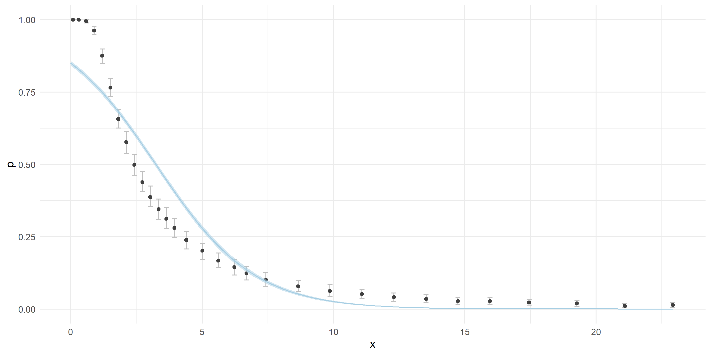
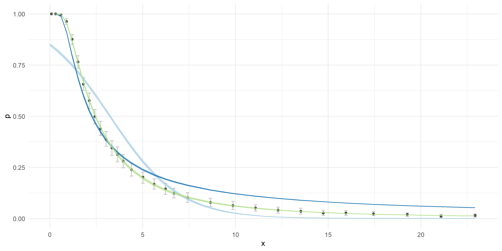

```{r setup, include=FALSE}
knitr::opts_chunk$set(echo = TRUE, fig.align="center")
```

# Summary

When developing Bayesian models we can quickly fall into the habit where we do not really think about the underlying data generating process. Instead, we are merely trying to fit distributions to our data. This lecture outlines why this is not good and suboptimal. As you will see on an example of golf putting, such Bayesian modeling does not only provide extremely good results, but can be also fun!

# Golf putting

We will try to model success of a golf putt given the distance from the cup. The cup is a fancy way of saying the hole in which you have to get your ball when golfing. And putting is the term used for golf swings that are taken when a player is very close to the cup. When putting the ball players are gently hitting it so it rolls on the ground and hopefully ends up in the cup.

Let us start by looking at our data:

| Distance | n   | y   |
|----------|-----|-----|
| 0.09     | 535 | 535 |
| 0.30     | 472 | 472 |
| 0.59     | 549 | 546 |
| 0.89     | 591 | 569 |
| 1.20     | 485 | 425 |
| 1.51     | 568 | 435 |
| ...      | ... | ... |
  
Our dataset has three columns, the distance from the cup in meters, the number of putts that were taken at that distance (n) and the amount of successful putts (y). A successful putt is the one where the ball ended up in the cup, as a result players are done with that particular hole and can move to the next one or end their run if this was the last hole. Like expected, the success of the putt declines with distance from the cup:

<center>
  
</center>

This example is based on work done by Andrew Gelman and Mark Broadie. Conusult the provided references for some additional details about all used models.

# The binomial logistic regression

Both the sigmoid shape and the format of the dataset suggest that some kind of a logistic regression might be a good fit here. Indeed, in our first model we will use the binomial logistic regression. In a way, binomial logistic regression is very similar to the Bernoulli one that we used last week for predicting sex of a person given their height. The link and the inverse functions are the same -- logit and inverse logit. Actually, we could just as well use a Bernoulli logistic regression here, but in this case we would have to change the format of the data. In Bernoulli logistic regression each golf putt would have to be its own data point, while in binomial logistic regression the putt results are summarized in terms of the number of attempts and the number of successes. As you can see from the data, they are already in the format expected by the binomial logistic regression. Below is a formal definition of the Binomial logistic regression:

$$y_i \; | \; x_i, n_i, \alpha, \beta \sim \text{Binomial}(n_i, \text{inv_logit}(\alpha + x_i \beta)),$$
$$\alpha \sim \text{Cauchy}(0, 2.5),$$
$$\beta \sim \text{Cauchy}(0, 2.5).$$

Binomial logistic regression is a very common GLM, it is so common that it is already fully implemented in Stan:

```
data {
  int N;             // number of data points
  array[N] int n;    // number of puts at each data point
  vector[N] x;       // distance for each data point
  array[N] int y;    // number of hits at each data point
}

parameters {
  real a;
  real b;
}

model {
  // priors
  a ~ cauchy(0, 2.5);
  b ~ cauchy(0, 2.5);
  
  y ~ binomial_logit(n, a + b*x);
}
```

We also put some weakly informative priors on our regression parameters, mainly to help out the sampling process and avoid any warnings in the warmup phase. All diagnostics show no reasons for concern, the mean value of the alpha (a) parameter equals 1.74 $\pm$ 0.001, while the mean value of the beta (b) parameter equals -0.54 $\pm$ 0.0002. The negative beta parameters means that probability of making a putt decreases with distance, which is obviously correct.

Below is a visualization of our fit plotted on top of the underlying data. The blue line depicts the mean predicted probabilities, the ribbon around the line depicts the 90% high density interval, note that there is very little uncertainty in predictions. The black dots denote the underlying data points along with their 90% HDI.

<center>
  
</center>

As we can see the model does not really fit our data that well. Can we do better? Well, if the answer would be no, then this lecture would be pretty bad. So yes, we can and we will do better!

# Modelling the error in aiming (error in the putting angle)

In our first modeling attempt, we did not really think about the data generating process. We just used a distribution that looked like a good fit to our data and as you can see the results are not spectacular. Let us now try and think what is actually going on. In golf putting the player tries to hit the ball towards the cup in a certain direction. Since the ball is smaller than the cup (the ball has a radius of of 2.135 cm, while the cup has the radius of 5.398 cm), there is some margin of error. In other words, even if the player does not hit the ball exactly in the desired direction, it might still go in. We can think of this error threshold as an angle, the closer we are to the cup the more margin for error we have. This concept is visualized on the figure below.

<center>
  
</center>

In an ideal scenario a golf ball with the radius r is hit directly along the desired direction towards the cup with the radius R. This desired direction is visualized as a black dotted line. The gray area and dashed gray lines visualize putts that still end up in the cup, but are not ideal. The farther away from the cup we are the more accurate we need to be. We can calculate the threshold angle ($\alpha$) in relation to the distance from the cup ($x$) as:

$$\alpha = tan^{-1} \left ( \frac{R-r}{x} \right ).$$

This angle defines the accuracy that is required in order for the ball to end up in the cup when putting from a certain distance. Our next step is to model the human error. Because players are not robots they cannot hit each ball exactly in the desired direction. Because of several factors there is some variability involved when trying to achieve this goal. We can assume that the hit angle ($\beta$) follows a zero-centered normal distribution with some standard deviation ($\sigma$). If the hit angle is smaller than the threshold angle ($\alpha$), the ball will end up and in the cup and if it is larger, it will not. We can model this as:

$$Pr(|\beta| < \alpha).$$
Since $\beta$ is a normally distributed variable, we can calculate its CDF by translating it to a random variable of a standard normal distribution ($Z = N(0,1)$). Say $x$ is a random normal variable:

$$x \sim N(\mu, \sigma),$$

we can calculate the probability that $x$ is smaller than some threshold $y$ as:

$$Pr(x < y) = \Phi(\frac{y - \mu}{\sigma}),$$

where $\Phi$ is the cumulative density function of the standard normal distribution $Z$. And we calculate the probability that $|x|$ is smaller than some threshold $y$ as:

$$Pr(|x| < y) = 2 \Phi(\frac{y - \mu}{\sigma}) - 1.$$

In our case this becomes:

$$Pr(|\beta| < \alpha) = Pr(|\beta| < \left ( tan^{-1} \left ( \frac{R-r}{x} \right ) \right ) = 2 \Phi \left ( \frac{tan^{-1} \left ( \frac{R-r}{x} \right )}{\sigma}  \right ) - 1.$$

The only unknown parameter in this model is $\sigma$, which denotes the standard deviation of the distribution of shot angles. With $\sigma$ we model the angular accuracy of golfers. The figure below visualized how the probability of making a putt given some distance changes in relation to $\sigma$. A larger $\sigma$ is associated with a less accurate golfer, which results in lower probability of making the putts.

<center>
  
</center>

Putting everything together gives us:

$$y_i \; | \; x_i, n_i, p_i \sim \text{binomial}(n_i, p_i),$$
$$p_i = 2 \Phi \left ( \frac{\alpha_i}{\sigma}  \right ) - 1 = 2 \Phi \left ( \frac{tan^{-1} \left ( \frac{R-r}{x_i} \right )}{\sigma}  \right ) - 1,$$

$$\sigma \sim \text{Cauchy}(0, 2.5).$$

Below is the full model code in Stan. We use the \texttt{transformed data} to calculate threshold angles ($\alpha$). Next, the process described above is used for calculating putt probabilities. Calculated probabilities are then used in the binomial model for estimating the accuracy of golfers ($\sigma$), which is the only parameter of our model. Finally, we use the \texttt{generated quantites} block to convert the accuracy of golfers from radians to degrees (Stan works with radians) and also to recalculate probabilities which we use to investigate the quality of our fit.

```
data {
  int N;             // number of data points
  array[N] int n;    // number of puts at each data point
  vector[N] x;       // distance for each data point
  array[N] int y;    // number of hits at each data point
}

transformed data {
  // golf ball radius 2.135 cm
  real r = 2.135 / 100;
  // golf hole radius
  real R = 5.398 / 100;
  
  // trehshold angle
  vector[N] threshold_angle = atan((R-r) ./ x);
}

parameters {
  real<lower=0> sigma;
}

model {
  // probabilities
  vector[N] p = 2*Phi(threshold_angle / sigma) - 1;
  
  // prior
  sigma ~ cauchy(0, 2.5);
  
  y ~ binomial(n, p);
}

generated quantities {
  // rad to deg converter
  real sigma_degrees = sigma * 180 / pi();
  
  // recalculate and return probs
  vector[N] p = 2*Phi(threshold_angle / sigma) - 1;
}

```

The fitting process executed without any issues and the diagnostics look fine, so we can continue with our analysis. The $\sigma$ parameters equals 0.022 $\pm$ 7 $\cdot$ 10^-6^ in radians and 1.23 $\pm$ 4 $\cdot$ 10^-4^ in degrees. Meaning that the standard deviation of golf putting angular errors in pro golfers is just above a degree. Which is very impressive.

The figure below visualizes the model's fit (the dark blue line) the ribbon behind it estimates its uncertainty with a 90% high density interval. The light blue line visualizes the binomial logistic model, while black points visualize the underlying data.

<center>
  
</center>

At short putting distances this model fits the data much better than the binomial one. However, it has some issues at longer distances, it greatly overestimates success of golfers there. The question is again, can we do better? As you will see, we can!

# Modelling the error in power (error in the putting distance)

Controlling the angle in which we hit the ball is not the only thing that we need to get right in order to make a successful putt. We also need to hit the ball with just the right amount of power. Imagine placing the ball a few centimeters away from the cup and smacking it will all your power. Even if you hit the ball in the ideal direction towards the cup, it will simply jump over it and continue its journey. Mark Broadie upgraded the previous model (developed by Andrew Gelman and Deborah Nolan) by adding an additional parameter that corresponds with the control golfers have over the distance of their putts.

Let us suppose that $\mu$ is the distance the golfer's shot would travel if there would be no hole and $x$ is the distance from the hole. The golf ball will go in if I) the angle allows the ball to go over the cup, and II) $\mu$ is in the range of $[x, x + 0.75]$. In other words, the ball will end up in the cup if it is hit in the right direction and if it will travel at most 75 centimeters farther than the cup if there were no cup. We will call this parameter distance tolerance ($d_t = 0.75 \; m$). The angular factor (I) was already used in the previous model, here we will also add the distance factor (II).

Since there is some tolerance of how hard a golfer can hit the ball, the golfers do not try to hit the ball so it stops exactly at the location of the cup as this would be supotimal. They overhit the ball a bit to increase their chances of making a successful put.We will assume that in an ideal putt the ball stops 25 centimeters behind the hole. We will call this parameter overshot ($o = 0.25 \; m$). The figure below (not to scale) visualizes this logic. The black dashed line denotes a perfect hit, which travels exactly the overshot distance farther than the cup. The ball will end in the cup if stops within the shaded area, the length of the shaded area is defined with the distance tolerance parameter ($d_t$).

<center>
  
</center>

Just like with angle, golfers do not always hit the ball perfectly -- like mentioned in a perfect hit, the ball would travel exactly the distance $x + o$. We again have variability or error in the distances due to various factors. Here we also have to account for the fact that the farther away from the cup we are, the harder it is to hit the ball with just the right amount of power. This happens because the distance tolerance interval is getting smaller in relation to the distance the ball has to travel as the distance grows. An actual hit can be thus modeled as $\mu = (x + o) (1 + \text{error})$. Similarly as before, we will model this error with a normal distribution that has a mean 0 and a standard deviation $\sigma_d$. So, $\sigma_d$ will represent the accuracy of golfers in terms of their distance accuraccy or hitting power. Putting all of this together in statistical notation gives us:

$$\mu \sim N(x + o, (x + o) \sigma_d).$$

The distance ($\mu$) is acceptable if $\mu \in [x, x + d_t]$ which has a probability of:

$$Pr(\mu \in [x, x + d_t]) = Pr(\mu < (x + d_t)) - Pr(\mu < x) = \Phi \left ( \frac{d_t - o}{(x + o) \sigma_d} \right ) - \Phi \left ( \frac{- o}{(x + o) \sigma_d} \right ).$$

To summarize, the golfers are aiming to hit the ball so it will travel exactly $x + o$. The hit will end up in the cup if the ball stops on the $[x, x + d_t]$ interval. The probability of that is calculated with the above equation. Putting everything together we get the following Bayesian model:

$$y_i \; | \; x_i, n_i, p_i \sim \text{binomial}(n_i, p_i),$$
$$p_{i,a} = 2 \Phi \left ( \frac{tan^{-1} \left ( \frac{R-r}{x_i} \right )}{\sigma_a}  \right ) - 1,$$

$$p_{i,d} = \Phi \left ( \frac{d_t - o}{(x_i + o) \sigma_d} \right ) - \Phi \left ( \frac{- o}{(x_i + o) \sigma_d} \right ),$$

$$p_i = p_{i,a} \; p_{i,d},$$
$$\sigma_a \sim \text{Cauchy}(0, 2.5),$$

$$\sigma_d \sim \text{Cauchy}(0, 2.5).$$

```
data {
  int N;             // number of data points
  array[N] int n;    // number of puts at each data point
  vector[N] x;       // distance for each data point
  array[N] int y;    // number of hits at each data point
}

transformed data {
  // golf ball radius 2.135 cm
  real r = 2.135 / 100;
  // golf hole radius
  real R = 5.398 / 100;
  
  // trehshold angle
  vector[N] threshold_angle = atan((R-r) ./ x);
  
  // distance parameters
  real o = 0.25;  // overshot
  real d_t = 0.75; // distance tolerance
}

parameters {
  real<lower=0> sigma_a;
  real<lower=0> sigma_d;
}

model {
  // angular probabilities
  vector[N] p_angle = 2*Phi(threshold_angle / sigma_a) - 1;

  // distance probabilities
  vector[N] p_distance = Phi((d_t - o) ./ ((x + o)*sigma_d)) -
               Phi((- o) ./ ((x + o)*sigma_d));
               
  // probabilities
  vector[N] p = p_angle .* p_distance;
  
  // priors
  sigma_a ~ cauchy(0, 2.5);
  sigma_d ~ cauchy(0, 2.5);
  
  y ~ binomial(n, p);
}

generated quantities {
    // rad to deg converter
  real sigma_a_degrees = sigma_a * 180 / pi();
  
  // recalculate and return probabilities
  vector[N] p = (2*Phi(threshold_angle / sigma_a) - 1) .*
                (Phi((d_t - o) ./ ((x + o)*sigma_d)) -
                Phi((- o) ./ ((x + o)*sigma_d)));
}
```

No issues were found in fitting and diagnostics processes.

The $\sigma_a$ parameters equals 0.018 $\pm$ 1.2 $\cdot$ 10^-5^ in radians and in 1.03 $\pm$ 7 $\cdot$ 10^-4^ in degrees. You can see that the angular error is now lower, this makes sense as the total error is now spread between two sources (error in the angle and in the distance), in the previous model all error was attributed to a single source (error in the angle). The $\sigma_d$ parameters equals 0.065 $\pm$ 1 $\cdot$ 10^-4^, this means that there is a standard deviation of 6% in the distance errors pro golfers make.

The figure below visualizes the performance of this model (the green color) in comparison with both previous models and the underlying data.

<center>
  
</center>

As you can see the final model fits the data extremely well. And the model is easy to defend and argument as it is based on the actual physical processes that occur during golfing. Development of such bespoke models is one of the strongest points of Bayesian statistics and one of the main reason for the rapid growth of the field over the last couple of years.

The goal of this lecture was to emphasize that, if possible, in statistical modeling we should try and describe the data generating processes as well as we can. Hopefully, the performance of the final model will convince you that this is indeed the correct mindset to have.

# Recommended readings

* Gelman A. & Broadie M. (2019). Model building and expansion for golf putting (https://mc-stan.org/users/documentation/case-studies/golf.html).

* Gelman A. & Nolan D. (2002). A Probability Model for Golf Putting, Teaching Statistics, 50, 151-153 (http://www.stat.columbia.edu/~gelman/research/published/golf.pdf).
