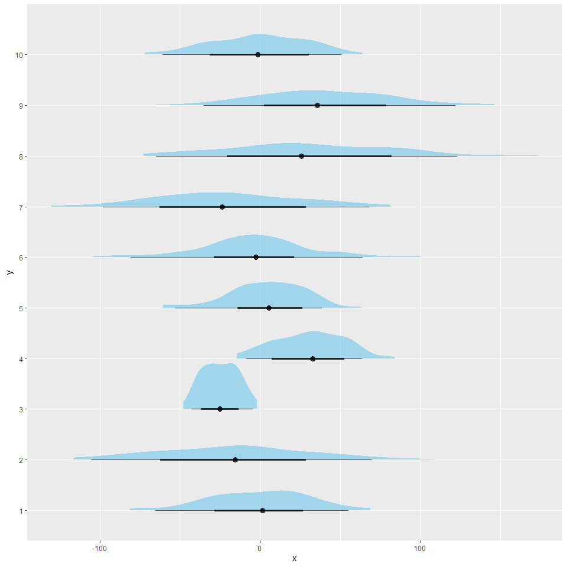
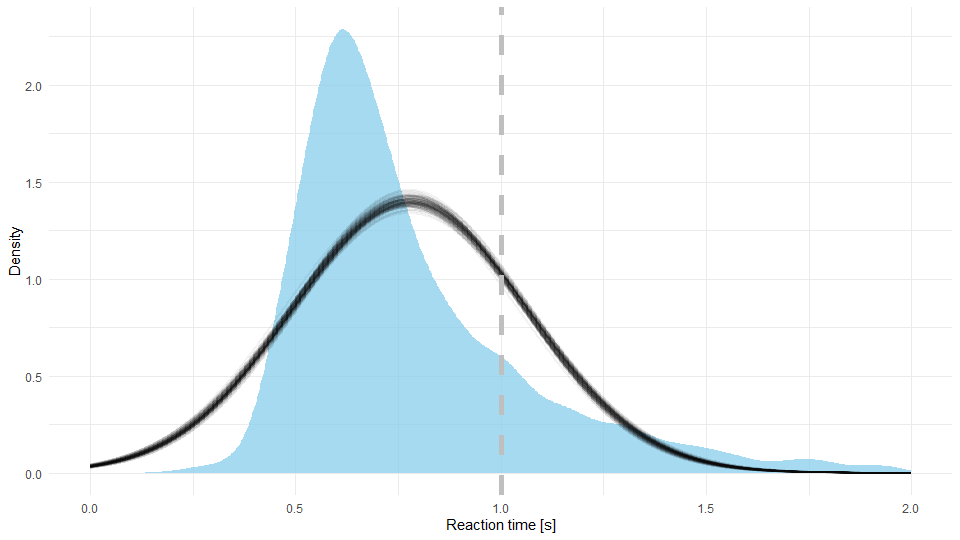
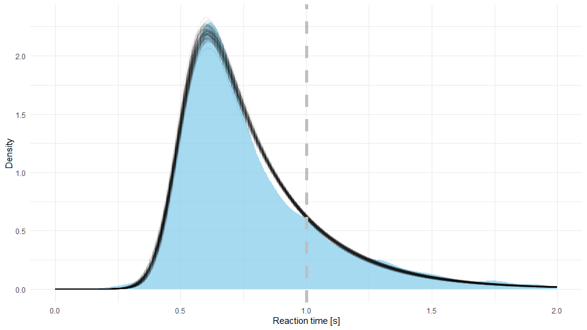

```{r setup, include=FALSE}
knitr::opts_chunk$set(echo = TRUE, fig.align="center")
```


# Summary

Bayesian modeling is an iterative process, we start by picking an initial model and settings its priors. To investigate whether our priors have undesirable effects that contradict domain knowledge we start by performing prior predictive checks. Once we are happy with our priors, we fit the model and diagnose the fitting process (traceplot, convergence, diagnostics ...). If all is good, we then execute posterior predictive checks to evaluate whether our model is suitable for answering the questions we are asking.

# Prior predictive checking

Prior predictive checking generates data according to a given choice of priors to assess whether the priors we have chosen are appropriate for the task at hand. Prior predictive checks are very useful for understanding the implications of prior choices on our model. When doing so we use data we generate ourselves, note that this data should be representative for the process we are trying to analyze. Meaning that we require at least some domain knowledge to execute this, if we are generating our own data that does not make any sense, there is a good chance that neither will our priors.

In the first example, we will use prior predictive checking and simulated data to get a deeper understanding of our model. In our case we will use logistic regression, but this process can be applied to any kind of model. In the linear regression model we will put $N(0, 1)$ priors on beta coefficients to inspect how outcomes vary with the number of predictors $n$. To inspect this, we will generate $n$ beta coefficients by using our prior distribution, values of the $n$ predictors will be drawn from $U(-1, 1)$. Next, we will use the logistic regression to simulate the $\theta$ parameter of the posterior distribution:

$$\theta = \text{inv_logit}(\sum_{i = 1}^n\beta x).$$

Below is the implementation of the described process.

```{R warning=FALSE, message=FALSE, results = 'hide', fig.width=16, fig.height=9}
# libraries --------------------------------------------------------------------
library(ggplot2)
library(arm)

# prior predictive checks ------------------------------------------------------
# function for simulating results
simulation <- function(n_x) {
  # result storage
  result <- vector()

  # simulate
  for (i in 1:1000) {
    betas <- rnorm(n_x, 0, 1)
    x <- runif(n_x, -1, 1)

    result <- c(result, invlogit(sum(betas * x)))
  }

  return(result)
}

# data frame for storing results
df <- data.frame(x=numeric(), n=factor())

# simulations
for (n_x in c(2, 8, 32)) {
  # get results
  result <- simulation(n_x)

  # store
  df <- rbind(df, data.frame(x=result,
                             n=paste0(n_x, " predictors")))
}

# set levels for proper ordering of sub graphs
df$n <- factor(df$n, levels = c("2 predictors", "8 predictors", "32 predictors"))

# plot
ggplot(data=df, aes(x=x)) +
  geom_histogram(bins=30) +
  facet_grid( ~ n) +
  xlab("theta")
```

The figure above visualizes our findings, when we do not have many predictors (two in our case) our prior choice will steer the value of $\theta$ towards 0.5. On the other hand when the number of predictors is high our priors will steer $\theta$ values toward both extremes (0 and 1). As you can see, even simple simulations can unravel some "hidden" properties of our model that can have important implications on our analysis.

In the second example we will use Stan to investigate prior predictive distributions that can be generated with our model. Let us say that we are interested in predicting height of a human from her/his weight. Here, we will do this with linear regression:

$$y \; | \; x, \beta, \sigma \sim N(\alpha + \beta x, \sigma).$$

With the following priors:

$$\alpha \sim N(150, 50),$$

$$\beta \sim N(0, 1),$$

$$\sigma \sim U(0, 50).$$

Priors above deserve some clarification. We will shift our predictor (weight) so it will start at zero. We will draw weights (our independent variable) from $U(50, 90)$, so we are assuming our population is composed of healthy adults. We put a weakly informative prior ($N(150, 50)$) based on an (un)educated guess on the intercept. Going from there we set the other two priors in a similar fashion.

Like in the previous example, we could again code everything in R, for illustrative purposes, this time around we will do it in Stan. Since we will use Stan only as a random number generator (fixed parameter sampler) we do not need the `model` block.

```
data {
  int<lower = 0> n; // number of observations 
  vector[n] x;      // weights
}

generated quantities {
  // priors
  real alpha = normal_rng(150, 50);
  real beta = normal_rng(0, 1);
  real sigma = uniform_rng(0, 50);
  
  // simulated data
  real y_sim[n] = normal_rng(alpha + beta * x, sigma);
}
```

Because you are already familiar with Stan and with the way Stan and R interact these code snippets should be easy to understand. The only novel thing is the `fixed_param = TRUE` setting in the model's sampling function in R. This tells Stan that we are not using it in the traditional way where we are interested in estimating parameters. Our parameters are known (fixed) and we will essentially use them merely for random number generation.

```{R warning=FALSE, message=FALSE, results = 'hide', fig.width=9, fig.height=9}
# libraries --------------------------------------------------------------------
library(cmdstanr)
library(posterior)
library(tidyverse)
library(ggplot2)
library(ggdist)

# modeling ---------------------------------------------------------------------
# compile the model
model <- cmdstan_model("./models/prior_predictive.stan")

# for Cauchy(0, 2.5) prior on the intercept use the model below
#model <- cmdstan_model("./models/prior_predictive_cauchy.stan")

# generate data
n = 100
weights <- runif(n, 50, 90)
weights <- weights - min(weights)

# stan data
stan_data <- list(n=n, x=weights)

# fit
fit <- model$sample(
  data = stan_data,
  fixed_param = TRUE,
  iter_sampling = 10
)

# analysis ---------------------------------------------------------------------
# extract draws
df <- as_draws_df(fit$draws())
df <- df %>% select(-alpha, -beta, -sigma, -.chain, -.draw, -.iteration)

# prep df for plotting
df_plot <- data.frame(x=numeric(), y=factor())
for (i in 1:nrow(df)) {
  df_plot <- rbind(df_plot, data.frame(x=as.numeric(df[i,]), y=as.factor(i)))
}

# simulated distributions of heights
ggplot(df_plot, aes(x=x, y=y)) +
  stat_halfeye(fill="skyblue", alpha=0.75)
```

As you can see from the figure above our priors can generate many different prior predictive distributions, they are pretty vague and as such relatively nonrestrictive after all. Because several of generated predictive distributions are plausible for describing human height we should be good to go here. Once we empower the model with our data it should produce a reasonable fit. Now let us try setting the intercept prior to something more restrictive, for example $\text{Cauchy}(0, 2.5)$, which was something that often appeared in our previous lectures. As you see none of the generated predictive distributions make sense for human height:



If results of your prior predictive checking do not make sense, this is a surefire sign that you should revisit your prior definitions.


# Posterior predictive checking

Posterior predictive checking is analogous to prior predictive checking but this time around used parameter draws come from the posterior distribution. If prior predictive checking was a technique for understanding implications of priors on the model, the intent of posterior predictive checking is to investigate how our model fits to the real data or to investigate the limitations of our model by using simulated data.

## Using replicated datasets

The most common posterior predictive check compares simulated datasets from the posterior predictive distribution against the actual data. Once we fit the model, we use the posterior distribution to create several replicate datasets. To create a replicate dataset we draw as many samples from the posterior distribution as there are in the original dataset. Once we create several such replicate datasets we compare whether the quantities we are interested in match between replicated dataset and the real dataset. If they do then we can proceed with our analysis, if they do not we have to revisit our model. It is important to emphasize here that if we are interested only in some quantites (e.g. means) then we are usually satisfied if our model does a good job at estimating only the quantities we are interested in.

In the example below we are interested in the mean temperature in Slovenia after the year 2000. We fit a normal model to our data and then generate 16 replicate datasets from our posterior samples. Visualization below visualizes replicate datasets (gray histograms) along with their means (gray vertical lines), while the black vertical line visualizes the sample mean. Since it seems like our model does a good job at estimating the mean temperature in Slovenia we can proceed with our analysis (whatever that might be). If we are interested in other quantities (e.g. variance) then we need to check whether our model does a good job at estimating those as well.

```{R warning=FALSE, message=FALSE, results = 'hide', fig.width=9, fig.height=9}
# libraries --------------------------------------------------------------------
library(cmdstanr)
library(ggplot2)
library(bayesplot)
library(posterior)
library(tidyverse)


# data prep --------------------------------------------------------------------
# load the data
data <- read.csv("./data/temperature.csv", sep=";")

# after 2000
data <- data %>% filter(year >= 2000)

# prep the data for stan
stan_data <- list(
  n=nrow(data),
  y=data$temperature
)


# modeling ------- -------------------------------------------------------------
# compile
model <- cmdstan_model("./models/normal.stan")

# fit
fit <- model$sample(
  data = stan_data,
  parallel_chains = 4
)

# traceplot
mcmc_trace(fit$draws())

# summary
fit$summary()


# posterior predictive check ---------------------------------------------------
# extract draws
df <- as_draws_df(fit$draws())

# replicated datasets
n <- 16
df_16 <- sample_n(df, 16)
df_ppc <- data.frame(temperature=numeric(), iteration=factor())

for (i in 1:n) {
  # generate n_sample observations
  temperatures <- rnorm(nrow(data), mean=df_16[i,]$mu, sd=df_16[i,]$sigma)
  
  # store
  df_ppc <- rbind(df_ppc,
                  data.frame(temperature=temperatures, iteration=as.factor(i)))
}

# means
df_ppc_means <- df_ppc %>% 
  group_by(iteration) %>% summarize(mean_temperature=mean(temperature))

# plot
ggplot(data=df_ppc, aes(x=temperature)) +
  geom_histogram(bins=30, alpha=0.5) +
  geom_vline(data=df_ppc_means,
             aes(xintercept=mean_temperature),
             size=1, alpha=0.5) +
  geom_vline(xintercept=mean(data$temperature), size=1, linetype="dashed") +
  facet_wrap(iteration ~ ., nrow=4) +
  xlab("T [°C]")
```

## A simple linear model for temperature prediction

Since a picture is worth more than a thousand words it is often a very good practice to plot your posterior distribution against real data and look for any discrepancies. As you saw in almost all of our previous lectures, when possible we should always prepare such a visualization. Below is a simple example that visualizes our simple linear regression model (`/model/simple_linear.stan`) for predicting the rise of average temperature in Slovenia through time against the actual data (average temperature for years 1901--2015). See `/code/posterior_predictive_linear.R` for our implementation. As you can see that at a glance the fit looks quite OK (we will try to improve it during our next session). Based on this visualization one might argue that the model has issues with capturing the seemingly increasing rise in temperature over the last couple of years, (unfortunately) this trend does not look linear, so it is completely reasonable that our model fails at capturing it. Since our model looks OK, we can can use it to do some simple analysis. Our only predictor were years and its $\beta$ coefficient is 0.013 (90\% CI 0.01--0.016), meaning that we are very confident that temperature has been rising for the last 100 years or so.


### Modeling reaction times

In the next example, we will try to build a model suitable for analyzing human reaction times. We will use reaction times from the Eriksen flanker test. In it participants are presented with an image of an odd number of arrows (usually five or seven). Their task is to indicate the orientation (left or right) of the middle arrow as quickly as possible whilst ignoring the flanking arrows on left and right. Traditionally, participant provide their answers by pressing one of the two buttons (one if the middle arrow is facing left and the other if it is facing right). There are two types of stimuli in the task: in the congruent condition (e.g. ‘<<<<<<<‘) both the middle arrow and the flanking arrows point in the same direction, whereas in the incongruent condition (e.g. ‘<<<><<<‘) the middle arrow points to the opposite direction of the flanking arrows. Since the incongruent case is more complicated, we would expect slower reaction times there, let us investigate this.

### Is a normal model good here?

As usual we will start with a simple model and build from there. We will start with a normal model (`/models/normal.stan`). If you are interested in the R code behind this experiment you can find it in `code/posterior_predictive_flanker.R`. Below is a visualization of our posterior (black lines) against real data (blue area) for the incongruent condition.


We can see that our fit is not the best. Indeed, it is a well known fact that reaction times are usually not normally distributed. Reaction times are traditionally right skewed (have a long tail on the right side of the distribution), this phenomenon arises because it is much more frequent for the participant to take additional time to provide an answer than it is for her/him to respond unnaturally quickly. To upgrade our model, we need to find a distribution that can accommodate this phenomenon.

A commonly used distribution for reaction times is the exponentially modified Gaussian (EMG), also called exponentially modified normal. It has three parameters: $\mu$ for the mean of the Gaussian component, $\sigma$ for standard deviation and $\lambda$ for rate of the exponential component. Mean of the distribution is calculated as $\mu + 1 / \lambda$ while its variance equals $\sigma^2 + 1 / \lambda^2$. Conveniently, this distribution is already implemented in Stan:

```
data {
  int<lower=1> n; // total number of data points
  vector[n] y;    // dependent variable
}

parameters {
  real mu;              // mean
  real<lower=0> sigma;  // stdev
  real<lower=0> lambda; // rate
}

model {
  y ~ exp_mod_normal(mu, sigma, lambda);
}
```

Below you can see that this distribution is indeed a much better fit for reaction times.



In more complex models (e.g. highly dimensional posterior distributions, complicated hierarchical models ...) visualizing our fits is often unfeasible. There, we can use the fit model in a generative manner and compare generated data with the real one, for example through some summary statistics. But we have to be careful here since summary statistics can be misleading.

In the case of reaction times, if we calculate the sample mean and compare it to means of both of our fits they practically equal (0.78 s). By now you should know that if we are interested only in means than the normal distribution is usually a perfectly viable choice. Furthermore, if we compare variances, we also get the same result for all three cases (0.08). However, if we take a look at a more descriptive statistics, such as 90% HDI (highest density interval) of the underlying distribution, we can see that the normal model is indeed not the best fit. 90% HDI of the underlying distribution equals 0.32--1.27 s for the normal model and 0.41--1.19 s for EMG model, this is already a significant difference! If we check HDI for our sample we get 0.42--1.21 s. If for some reason we were unable to plot the fit distribution against the data, exploring HDIs would also confirm that the EMG model is indeed a better fit.

Like we said, if we were interested in means the normal model would suffice, but if our questions are more complex than the normal model would most likely provide us with erroneous answers. For example, let us say that for some reason we are interested in the percentage of responses where reaction time was slower than one second (marked with a dashed vertical line in both visualizations above). With the normal model 21.66% (90% HDI 20.18--23.09%) of responses were slower than one second, while in the case of EMG model 16.95% (90% HDI 15.76--18.24%) were slower, we again have a discrepancy between results from both models. If we look at the fit we can confidently say that the inferences made with the EMG model are much more credible here (in our sample 17.82% of reactions were slower than 1 s).

### Comparing two groups and the region of practical equivalence

Finally, let us compare reaction times between incongruent and congruent conditions. In the incongruent case the mean reaction time equaled 0.78 s (90% HDI 0.77--0.79 s) and 0.62 s (90% HDI 0.61--0.63 s) in the congruent case. We are as sure as we can be ("100%") that reaction times in the congruent condition are faster than in the incongruent one. 

Next, we will learn how we can use something called a region of practical equivalence (ROPE) to show whether some samples are equal or to take into account the measurement error of our experiment. For this illustration, let us assume that we used a really poor measuring instrument, maybe reaction times were measured manually via a stopwatch -- overseer of the experiment was watching the participant and measured her/his reaction times manually by pressing the start and stop buttons on his watch. Through some black magic we deduced that this approach has a measurement error of 0.15 s. As a result, reaction times with a difference smaller than 0.15 s should be treated as equal. In more technical terms, we will use a 0.15 s ROPE in our comparison. With this ROPE we are only 80.32% sure that reaction times are faster in the case of the congruent condition. Now, there is a 19.68% chance that due to our measurement error reaction times in both conditions are equal.

ROPE is not useful only when taking measurement error into account, but also when testing whether two groups are equal. We need some kind of tolerance in such comparisons -- heights of 183.2123125 cm and 183.2123126 cm are theoretically different but for the majority of practical purposes they are definitely equal.

## Fitting our model to simulated data

Another important technique in posterior predictive checking is fitting our model to simulated data. The advantage of simulated data is the fact that we know all the details of the data generating process (well, we were the ones who created the process in the first place). This can be of tremendous value when investigating the strengths and weaknesses of our model. For example, we can easily find out which aspects of the process our model is struggling to reconstruct. By providing our model with extreme data, we can investigate how robust it is. When we are comparing several groups, we can inspect how sensitive our model is -- how large the difference between groups needs to be in order for our model to detect them. Or we can investigate how large our sample size needs to be, so we are able to detect a difference between two or more groups. As you can see, just like with prior predictive checking, exploratory analysis with simulated data has many practical usages!


# Recommended readings

* Gelman A. et al. (2020). Bayesian workflow, https://arxiv.org/abs/2011.01808.

# Additional readings

* Betancourt M. (2020). Towards A Principled Bayesian Workflow, https://betanalpha.github.io/assets/case_studies/.

* Gnabry J. et al. (2018). Visualization in Bayesian workflow, https://arxiv.org/abs/1709.01449.
