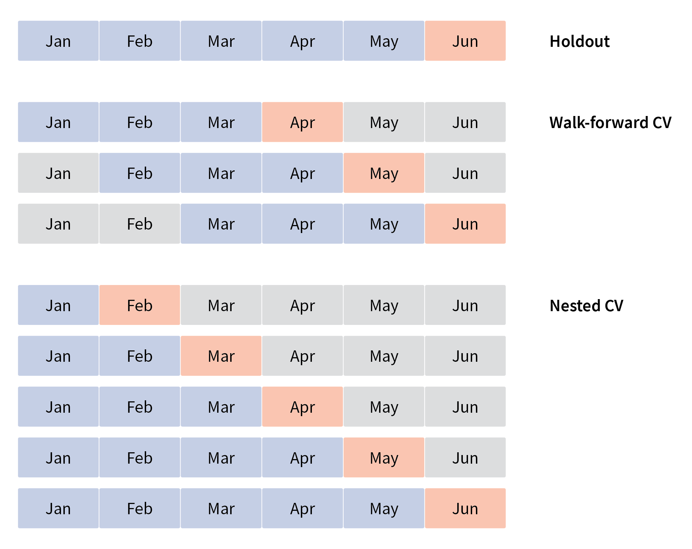
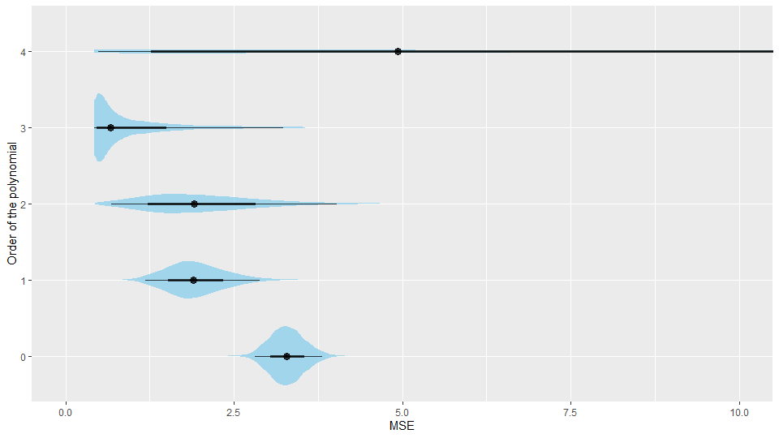
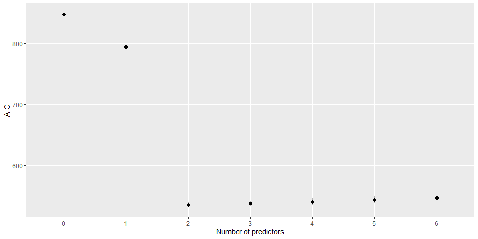
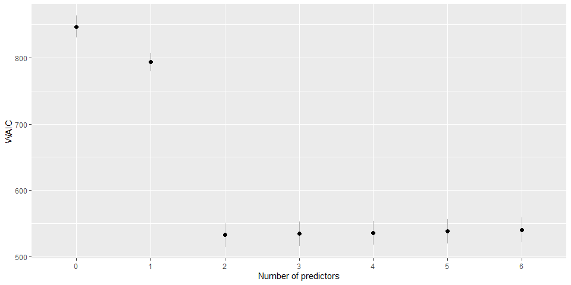

```{r setup, include=FALSE}
knitr::opts_chunk$set(echo = TRUE, fig.align="center")
```


# Summary

Cross-validation is a widely spread technique for estimating how well our models generalize (how they fare when encountering unknown data). Since in Bayesian statistics we are always working with probability distributions we can use log-score as our go-to model evaluation measure. This allows us to resort to information theory for calculating good cross-validation approximations without actually performing the actual (often very time consuming) cross-validation. An important point to emphasize here is that cross-validation and regularization are not mutually exclusive, they go hand in hand and traditionally we use both at the same time.

# Cross-validation

Cross-validation (CV) is a procedure for estimating the generalization error of our models. To evaluate model's generalization CV tests our models against unknown data in order to find out how well our model generalizes (e.g is our model overfitting, do we have selection bias ...). Since you should be already familiar with the majority of CV techniques (leave-one-out cross-validation, leave-p-out cross-validation, k-fold cross-validation, holdout ...) we will sift through them relatively quickly. The gist of CV is to split the dataset into two subsets -- the train set and the test set. The train set is then used for building the model and the test set is used for evaluating it. This way we are evaluation our model on data it has never seen before. Note that the same methods apply when we have to split the data into three sets (the train set, the validation set and the test set), for example for hyper parameter tuning. CV methods are split into two groups -- exhaustive and non-exhaustive.

Exhaustive CV methods split the original dataset (containing $n$ observations) into train and test sets in all possible ways. The most exhaustive and consequently the most computationally intensive and time consuming is leave-$p$-out cross-validation (LpO CV). In it we use $p$ observations as the train set and the remaining $n - p$ as the test set. We use this split in order to train and test our model. We repeat this process until we exhaust all possible train sets -- all subsets of size $p$ in our whole dataset. This means that we need to repeat the process $n \choose p$ times. As you might imagine, this is more often than not unfeasible.

A more popular exhaustive CV technique is called leave-one-out cross-validation (LOOCV), a variant of LpO CV with $p$ set to 1. In LOOCV we train our model on all observations with the exception of one (the one we leave out). The left out observation is used for model evaluation. We repeat the process so each observations is left out exactly once, we end up repeating the process $n$ times, once for each observation. If LOOCV is also too complex to execute in practice we have to resort to non-exhaustive CV techniques.

Non-exhaustive CV techniques do not split the original dataset in all possible ways. Since they execute training and testing on only a subset of all possible combinations, they are only an approximation of LpO CV. The first non-exhaustive method we will get to know is called $k$-fold cross-validation. Here, we first randomly partition our dataset into $k$ subsets, one of these subsets is then used as the test set and the union of others as the train set. We repeat this validation $k$ times so each of $k$ subsets is picked as the test set once. If $k = 3$ we are performing 3-fold CV, meaning that we will validate our model three times, once for each of the three random subsets. If $k = n$ we are performing LOOCV.

The simplest and fastest CV method is called holdout. Here we split the data randomly into a train and a test set only once. The name holdout comes from the fact that we holdout a certain percentage of the data and do not use it for training purposes. What percentage of data goes into the test and what into the train set depends on our concrete use case and the size of the dataset, but it is recommended to holdout at least 20% of the data for testing purposes. Since with holdout we are not really doing much of CV, holdout is often treated as a separate estimator (not as a member of the CV methods family), but with some imagination we can classify it as a CV method.

## Cross validation in time-sensitive data

When executing any kind of cross-validation it is important to adapt it to our use case. For example, if we are using time sensitive data this needs to be taken into account. Predictions have to be made on data that was available at the point at which we are making the prediction. In the example that follows we will try to model how temperature changes through years. In other words, given a year our model will be able to predict temperature in that year. If we want to test how good the model is for making future predictions, which is what we are traditionally interested in, then we need to simulate such a scenario, e.g. we use data before the year 1995 for training the model and after 1995 for evaluating the model. If we are interested in future temperatures then training the model on the most recent observations and then using the model to predict historical temperatures makes no sense. Since such a model is clairvoyant its results will be probably unrealistically good.

A common approach is to use holdout, there we have to be careful and split it so that the test set is composed of the newest data and the train set it composed from older data. The visualization below shows an example of holdout where we split six months of data into a five month train set (blue rectangles) and a one month test set (red rectangle). However, this way we only have a single split which means that we will be often unable to estimate uncertainty of the calculated metrics (if our models are not Bayesian that is).

There are two CV techniques that we can stumble upon in the literature. The first one is called walk-forward CV, there we use a sliding window approach to construct multiple train and test splits on our data. The visualization below shows how such a split might look like if we used a four month wide sliding window on our six months of data. This results in three CV splits, each one composed of a three month train set and a 1 month test set. This approach is suitable if you have a lot of data as each CV split discards a certain chunk of it. 

The nested CV approach uses a constant size of the test set and increases the training set size in each split. As the training set grows, the test sets is pushed towards newer data. The final split is similar to a holdout split -- the newest data is used for the test set and all of the remaining data is used for the training set. The problem with this approach is that our estimates of performance and uncertainty are based on models that were trained on a different amount of data. This can give us performance estimates that are lower and uncertainty estimates that are higher than they should be. The visualization below how the nested approach might look like on our hypotethical dataset.

<center>
  {width=50%}
</center>

## Example

We will use cross-validation to try and find a good regression model for predicting temperature from years. We will evaluate several polynomial regressions with a different order of the polynomial term:

$$y \; | \; x, \beta \sim N(\sum_{i=1}^{p}{\beta_i x^{i-1}}, \sigma),$$

$$\beta_2, \beta_3, ... , \beta_{p} \sim Cauchy(0, 1).$$

Above, $y$ represents our dependent variable (average yearly temperature in °C), $x$ our independent variable (years) and $p$ the order of our polynomial regression. We set $p$ to 4, thus our simplest model is a traditional normal model:

$$y \sim N(\beta_1, \sigma)$$

and our most complex model is a 4^th^ order polynomial regression:

$$y \; | \; x, \beta \sim N(\beta_1 + \beta_2 x^1 + \beta_3 x^2 + \beta_4 x^3 + \beta_5 x^4, \sigma).$$

Source code for this experiment can be found in `/code/cross_validation.R`. The figure below visualizes how our models of varying complexity (numbers above graphs denote order of the used polynomial) fit the underlying data.


To evaluate our models, we performed holdout cross-validation where we trained the model on temperature observations before the year 1995 and tested it on observations after the year 1995. To emphasize that CV is CV regardless of the modeling methodology (Bayesian modeling, random forests, deep neural networks ...) we used mean squared error (MSE) to measure model's error. MSE was used because we are evaluating the posterior mean and the decision-theoretic optimal estimator for the posterior mean is MSE. If we were evaluating something else then a different measure would be optimal (e.g. absolute error if we are interested in the median). So, to pick the optimal evaluation method we need to be familiar with decision theory. Bayesian modeling is again at an advantage here, since we are always working with distributions we can always use log-score to measure the quality of our fit. Indeed, log-score is the go-to measure for evaluating Bayesian models.

Mean squared error (MSE) is calculated as:

$$\text{MSE} = \frac{1}{n} \sum_{i=1}^n (y_i - y'_i)^2,$$

where $n$ is the size of the dataset, equal to the size of the test set when evaluating how good the model is for predicting new values (out-of-sample evaluation) or the size of the train set when evaluating how good the models fits the training data (in-sample evaluation). $y_i$ denotes an actual observation and $y'_i$ the predicted value for that observation. We first checked how our models fit the training data, this is visualized on the figure below.


As you can see more complex models fit the data better, this is expected behavior. Complex models are more prone to overfitting and will as a rule give better in-sample results. If we increased our complexity even further we would get an even lower in-sample error. But we are traditionally interested in models that generalize well, to evaluate how our models generalize let us check the out-of-sample error:



Indeed, it seems like the 4^th^ order polynomial regression overfits, as you can see its out-of-sample error is higher than that of the 3^rd^ order polynomial regression. In our case, 3^rd^ order polynomial regression seems to be the best model. The table below confirms this finding.

| $p$ | Mean MSE        | q5%  | q95% |
|---- |-----------------|------|------|
| 0   | 3.89 $\pm$ 0.01 | 2.81 | 5.08 |
| 1   | 2.50 $\pm$ 0.01 | 1.52 | 3.65 |
| 2   | 2.61 $\pm$ 0.02 | 1.22 | 4.51 |
| 3   | 1.48 $\pm$ 0.02 | 0.67 | 3.16 |
| 4   | 7.47 $\pm$ 0.17 | 1.00 | 20.5 |


# Approximating cross-validation

With really complex models or when we have large amounts of data exhausting cross-validation techniques can be too time consuming for practical use. On the other hand holdout has its own problems, since we are splitting the dataset only once our findings might be too optimistic or too pessimistic and it does not work well if our sample size is small. Luckily in Bayesian modeling we have several good alternatives that are able to approximatie cross-validation. In the next section we will take a look at some of these approximations, as you will see they are all based on information theory.

## Information theory

Information is the reduction in uncertainty caused by learning an outcome. Uncertainty arises from frequency distributions of events. For example, the uncertainty about what the weather will be like tomorrow in Ljubljana is much higher than it is for Los Angeles (high chance of sunny weather) or Glasgow (high chance of rain). A formal way to deal with uncertainty is through information entropy ($H$). The formulation was developed by Claude Shannon in 1948, it essentially says that uncertainty in a probability distribution is the average (minus) log-probability of an event.

$$H(p) = - E [log(p_i)] = - \sum_{i=1}^n p_i \; log(p_i).$$
You can also think of the information entropy as the potential surprise. If entropy is low the potential of surprise is higher. For example, we are much more surprised if we see rain in Los Angeles than we are if we see it in Ljubljana.

Information entropy plays a pivotal role in model evaluation, we can use it to evaluate how far our model is from the target (the truth). The key lies in the Kullback-Leibler divergence (also known as K-L divergence):

$$D_{KL}(p, q) = \sum_{i=1}^n p_i (log(p_i) - log(q_i)) = \sum_{i=1}^n p_i \; log(\frac{p_i}{q_i}),$$
where $p_i$ are the probabilities of true events ($p$ is the truth) and $q_i$ are predictions made by our model ($q$ is the model). In other words, $D_{KL}$ is the average difference in log probability between the truth and the model.

$D_{KL}$ measures the distance from $q$ to $p$ and this distance is not symmetric. This makes sense, when a person that was never outside of Ljubljana goes to LA and sees rain she/he will be less surprised than if a person that was never outside of LA goes to Ljubljana and sees rain. Understanding $D_{KL}$ is important in understanding why simpler models (usually) work better -- they have higher entropy! The distance from a simple model to reality is shorter.

Lower divergence means better model, the best model is the one where truth and the model are the same, in that case $D_{KL}$ equals zero:

$$D_{KL}(p, q) = D_{KL}(p, p) = \sum_{i=1}^n p_i (log(p_i) - log(p_i)) = 0.$$
```{r fig.width=6, fig.height=4}
# libraries
library(ggplot2)

# truth - rain and sun probabilities for tomorrow
p <- c(0.4, 0.6)

# D_KL function
D_KL <- function(p, q) {
  sum(p * (log(p) - log(q)))
}

# q sequence
q_seq <- seq(from=0.01, to=0.99, by=0.01)

# D_KL
D_KL_seq <- sapply(q_seq, function(q) { D_KL(p, c(q, 1-q)) })

# plot
df <- data.frame(q=q_seq, D_KL=D_KL_seq)
                 
ggplot(data=df, aes(x=q, y=D_KL)) +
  geom_line(color="skyblue", size=1) +
  theme_minimal() +
  ylab("K-L divergence")
```

The problem in practice is that we do not know the truth $p$, we only have the model $q$. It turns out that we do not need the truth part in the $D_KL$ since it is in its essence merely an additive term. We can get a relative difference from the truth without knowing the truth. In other words, we do not know what the truth is, but we do know how far away from it we are with a particular model. What comes in handy for us Bayesians is the fact that we can estimate divergence with log-score (sum of log likelihoods of each observation):

$$\text{LS} = -2 \sum_{i=1}^n log(p(y_i \; | \; \theta)).$$

Note here, that due to historical reasons to get deviance we usually multiply the log score by -2. In the following example we will use log-score to evaluate various models. To gain some additional insight into evaluation methods we will use a toy (simulated) dataset. As we know by now, toy datasets are great since we know what the data generating process is. In our case we will use:

$$y \sim N(1 + 1.5x_1 - 2.5x_2, 1).$$

We will fit multiple linear regression models of varying complexity to our toy data:

$$y \; | \; x, \beta, \sigma \sim N \left(\alpha + \sum_{i=1}^m \beta_i x_i, \sigma \right),$$

where $\alpha$ is the intercept, $\beta$ are the beta coefficients, $\sigma$ the standard deviation and $m$ the parameter that determines the model's complexity. We expect to get the best results when $m = 2$ since that is the complexity of the data generating process. If we use a lower value of $m$ we expect underfitting, while with larger value we expect overfitting -- the model will also fit to predictors that are nothing but noise. The most complex model that we used had $m = 6$. The figure below visualizes in-sample and out-of-sample approximated deviance (means and 90% HDI) when models were trained and tested on 20 observations.


On the left side of the figure, we see a similar trend as in the previous example -- more complex models have a lower in-sample deviance (error). This will always be the case, more complex models are able to (over)fit the training data better. On the right side, we can see that out-of-sample deviance is the lowest (the best) when our model uses the same complexity as the data generating model -- any other result would be a reason for alarm here. High out-of-sample deviance for complex models again tells us that these models overfit. Figure below shows the difference between in-sample and out-of-sample deviance for all of our models.

What is also important here is the fact that as model's complexity grows the in-sample deviance is getting lower and (once we get past the "optimal" model) the out-of-sample deviance starts getting higher. As a result the difference between in-sample deviance and out-of-sample deviance increases with model's complexity.

Let us repeat the process on a larger dataset, this time around we trained and tested our models on 200 observations. Everything described above also holds here, but pay attention to the difference between the in-sample and the out-of-sample deviance. The relative difference here is much lower, if we have more observations it is harder for models to overfit and the out-of-sample error will be lower in comparison with the in-sample error.


Findings of this toy example will play an important role in the cross-validation approximation techniques we will meet in sections that follow.

## Akaike information criterion

Akaike information criterion (AIC) is the simplest estimator of the out-of-sample deviance. To estimate out-of-sample deviance from in-sample deviance we need to take into account the trends uncovered by our toy example. AIC does this in a very simple way:

$$\text{AIC} = D_{is} + 2p = \text{LS} + 2p,$$
where $D_{is}$ is the in-sample deviance which we estimate with log-score ($S(q)$) and $p$ is the number of model's parameters. So AIC approximates out-of-sample deviance by calculating the in-sample deviance and penalizing it for the number of parameters. It is very simple to understand and calculate but it has several downsides:

* priors have to be flat or overwhelmed by the data,
* the sample size ($n$) is much greater then the number of parameters ($p$),
* the posterior distribution is approximately multivariate Gaussian.

As you see, this is not a truly Bayesian approach, but nevertheless gives good results if the above conditions are met. In the figure below we used AIC (mean and 90% HDI) to compare our models from the toy example.



## Widely applicable information criterion

Widely applicable information criterion (WAIC, also called Watanabe-Akaike information criterion) is an out-of-sample deviance estimator that is aware of informative priors and does not require a multivariate Gaussian posterior. WAIC is calculated as

$$\text{WAIC} = -2 (\text{lppd} - p_{\text{WAIC}}),$$

where $\text{lppd}$ is the log-pointwise-predictive-density, and $p_{\text{WAIC}}$ the effective number of parameters.

The distinguishing feature of WAIC is that it is pointwise -- uncertainty in prediction is considered point by point. WAIC assesses the model with respect to fitting each observation and then sums up across all observations. In practice in Bayesian statistics we are working with a distribution of log-scores, since we want the average log-score (average over the posterior distribution) we calculate $\text{lppd}$ as:

$$\text{lppd} = \sum_{i=1}^n log \left( \frac{1}{s} \sum_{j=1}^s p(y_i \; | \; \theta_j) \right).$$

So, for each observation $i$ we are taking the average log-likelihood of that observation conditional on $s$ samples ($\theta$ parameters). Finally, lppd is the total across observations of the logarithm of the average likelihood of each observation.

The effective number of parameters is calculated as:

$$p_{\text{WAIC}} = \sum_{i=1}^n V(y_i) = \sum_{i=1}^n \underset{j \in s}{\text{var}} \left(log(p(y_i \; | \; \theta_j)) \right),$$
where $V(y_i)$ is the variance of log-likelihood in observation $i$. To get $V(y_i)$ we calculate the variance in log-likelihood of $y_i$ for all samples ($j \in s$) from the posterior distribution. WAIC looks complicated but it is fortunately quite easy to calculate and is readily implemented in several popular R libraries for Bayesian statistics (e.g. loo, rethinking). In the figure below we used WAIC (mean and SE) to compare our models from the toy example.



## Model weights and averaging

So far we were only interested in finding out which model is the best (model selection). When making such decisions we are often faced with multiple models that all perform fairly well. In this case we can use Akaike weights to determine how decisions made by multiple models should be mixed together (averaged). The Akaike weight of model $i$ is:

$$w_i = \frac{e^{-\frac{1}{2} \Delta \text{WAIC}_i}}{\sum_{j=1}^m e^{-\frac{1}{2} \Delta \text{WAIC}_j}},$$

where $m$ is the number of models we are evaluating and $\Delta \text{WAIC}_i$ is the difference in WAIC between model $i$ and the best model. The equation might look a bit funky, but all it is doing is reversing the -2 multiplication followed by reversing the log transformation -- it is putting WAIC on the probability scale. In the equation above we used WAIC ($\Delta \text{WAIC}$) to calculate weights, in practice you can use any other measure as well (e.g. $\Delta \text{AIC}$ or $\Delta \text{LOOIC}$). Akaike weights can be interpreted as estimates of the probability that a model will make the best prediction on new data conditional on the set of models considered. The figure below visualizes Akaike weights for our toy example.


## Leave one out information criterion

Leave one out information criterion (LOOIC) is currently considered as the state-of-the-art Bayesian cross validation approximation technique. In the literature the method is sometimes called PSIS LOO, since at its core lies Pareto smoothed importance sampling (PSIS).

LOOIC uses a method called importance sampling to reweigh posterior samples as though the sample $y_i$ had not been yet observed. We want to give weights to each posterior draw in a way that would adjust the posterior to what it would have been if $y_i$ was not yet observed. So what should the weighting for the unobserved sample be? The sample weight is the inverse of the probability that a particular posterior draw gave to that observations:

$$\frac{1}{p(y_i \; | \; \theta_j)}.$$

Importance sampling is very noisy, the sampling weights are very heavy tailed and it often happens that a single posterior sample is assigned a very low probability and as a result dominates the importance sample adjusted posterior. This is where Pareto smoothing comes in. Since it turns out that the importance weights fit a Pareto distribution nicely this algorithm uses it to smooth out the tails. As we saw, the core element of WAIC is lppd (log-pointwise-predictive-density), with LOOIC the core element is elpd (expected-log-pointwise-predictive-density):

$$\text{elpd} = -2 \sum_{i=1}^N log \left( \frac{1}{\frac{1}{s} \sum_{j=1}^s \frac{1}{p(y_i \; | \; \theta_j)}} \right).$$

Just like in the case of WAIC, LOOIC is readily implemented in the loo R library which, as you can see in the code examples (`./code/deviance.R`), is quite easy to use. In the figure below we used LOOIC (mean and SE) to compare our models from the toy example.


There are several other methods for estimating out-of-sample deviance, for example the deviance information criterion (DIC) and Bayesian information criterion (BIC). Since these methods are a bit older and have been replaced by newer and better methods we decided to omit them in this document.

# Recommended readings

* **Chapter 6 (Overfitting, Regularization and Information Criteria)** in Mcelreath R. (2016). Statistical Rethinking: A Bayesian Course with Examples in R and Stan. CRC Press.

* **Chapter 10 (Model Comparison and Hierarchical Modeling)** in Kruschke J. K. (2015). Doing Bayesian Data Analysis: A Tutorial with R, JAGS, and Stan (2nd edition). Academic Press.

# Additional readings

* Vehtari A., Simpson D., Gelman A., Yao Y., Gnabry J. (2015). Pareto Smoothed Importance Sampling, https://arxiv.org/abs/1507.02646.

* Vehtari A., Gelman A., Gnabry J. (2015). Practical Bayesian model evaluation using leave-one-out cross-validation and WAIC, https://arxiv.org/abs/1507.04544.

* Gelman A., Jessica H., Vehtari A. (2014). Understanding predictive information criteria for Bayesian models, Statistics and computing, 24, 997--1016.
