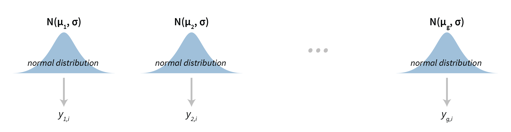
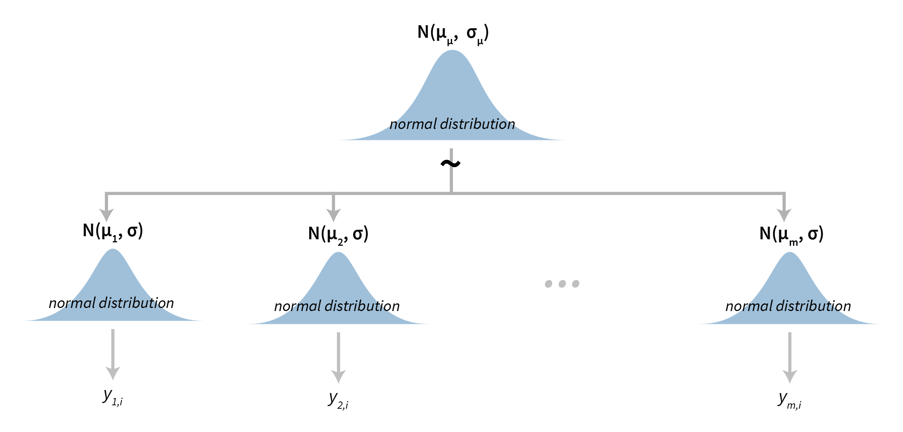
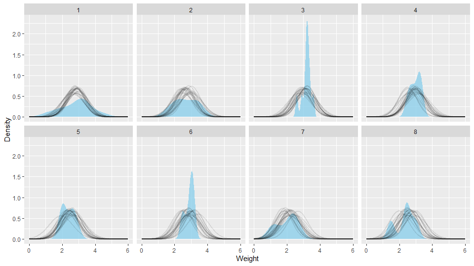
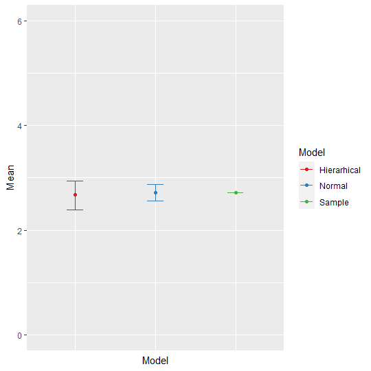
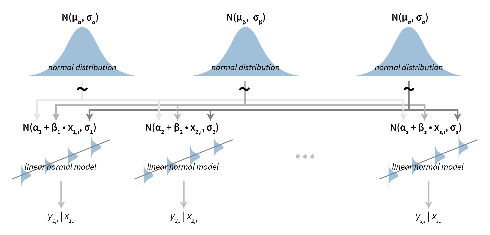
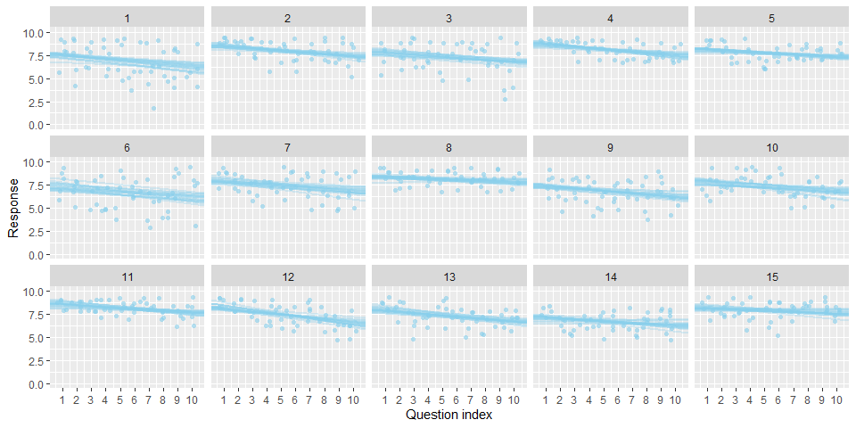
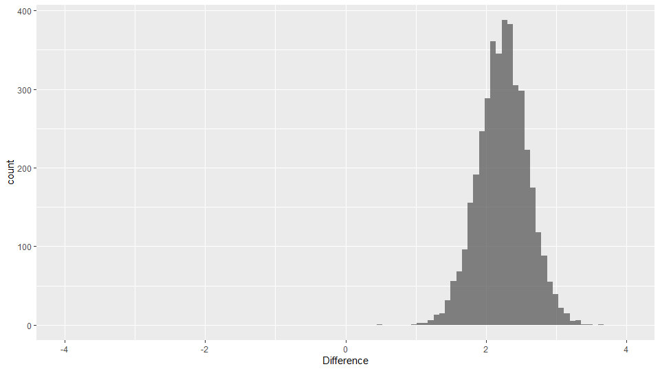

```{r setup, include=FALSE}
knitr::opts_chunk$set(echo = TRUE, fig.align="center")
```


# Summary

In Bayesian modeling hierarchical models (also called multilevel models) are an extremely powerful tool. As already emphasized a couple of times now, when modeling we should try to describe the data generating process (and not fit some distributions to some data). Since data generating processes often have a hierarchical structure (e.g. groups of students, multiple repetitions of an experiment ...), hierarchical models enable us to efficiently describe such data generating processes.


# Piglets

We will build our first hierarchical (multilevel) model from the ground up by using a practical example. Our dataset (`./data/piglets.csv`) includes the weight of little piggies at birth along with the information about who the mother of each of the piglets is. For the sake of this illustrative example we will assume that weights of piglets at birth are normally distributed.

The simplest model we can build is the traditional normal model (`./models/normal.stan`):

$$y_i \; | \; \mu, \sigma \sim N(\mu, \sigma),$$

where $y_i$ denotes the birth weight of piglet $i$. Visually this model can be represented as:

<center>
{width=50%}
</center>

This model discards the information about mama pigs and fits a normal distribution over all piglet weights. With this approach we obviously lose the ability to compare piglet weights between mama pig. But this does not mean that the model is useless -- it is perfectly OK for making several more general comparisons, such as comparing birth weight of pigs with those of baby tigers (if we had another similar dataset containing weights of baby tigers that is). The figure below visualizes how this model fits the underlying data:

<center>
{width=50%}
</center>

If our goal is not to perform general comparisons but the comparison of piglet birth weights between different mama pigs, then we need a different model. We can simply model the mean of each group separately:

$$y_{g,i} \; | \; \mu_g, \sigma \sim N(\mu_g, \sigma),$$

where $y_{g,i}$ represents the weight of piglet $i$ that was born to mama pig $g$, meaning that $\mu_g$ is the mean parameter for group (mama pig) $g$. Note here, that we are assuming equal variance (or standard deviation) in weights between all groups, if we assumed that each group has its own variance then we could just use the traditional normal model multiple times, once for each mama pig. Below is a visual representation of the group normal model:



With this model we acknowledge the fact that each piglet has its own mother, but we discard the fact that they are all piglets. As a result we are now able to make comparisons between groups (between piglets belonging to different mama pigs) but lose the capability of more general comparisons (e.g. inter-species). The figure below visualizes how this model fits the underlying for each mama pig (group) separately:


Based on this figure, one could argue that the assumption that the variance between groups is the same is not correct. This is a valid case, since we can see that because of this constraint our model does not fit the underlying data well in some cases (e.g. mama pig #3 or #6). So, a possible model upgrade would be to also model variances on the group level. We decided not to do that because we were interested mainly in mean weights and wanted to keep the model as simple as possible for the purpose of this illustration. Furthermore, our dataset is quite small, for getting good variance estimates we usually need more data than we have in this case.

In Bayesian statistics we can easily have the best of both worlds through hierarchical modeling. Actually, one could easily argue that in our case such a model is the only reasonable approach since we have a very clear hierarchical structure in our data generating process. By linking group means in a hierarchical fashion, our model becomes:

$$y_{g,i} \; | \; \mu_g, \sigma \sim N(\mu_g, \sigma),$$

$$\mu_g \; | \; \mu_\mu, \sigma_\mu \sim N(\mu_\mu, \sigma_\mu).$$

So, to get a hierarchical model we simply inject the information about the hierarchical structure of our data generating process into the model by linking all group level means ($\mu_g$) together using another distribution. In our case we are linking group level means together with a normal distribution, this top-level normal distribution is defined with parameters $\mu_\mu$ and $\sigma_\mu$. As a result $\mu_\mu$ now defines the mean birth weight of all piglets, while $\mu_g$ is the mean birth weight of piglets belonging to a particular mama pig. Here, $\mu_mu$ serves a similar function as $\mu$ in the traditional normal model -- the mean parameter for birth weight of all piglets. It is important to note here that the same does not hold for $\sigma_\mu$, $\sigma_\mu$ depicts the standard deviation of group means ($\mu_g$) and not the standard deviation between birth weights of all piglets like in the traditional normal model. This hierarchical structure can be nicely seen on the model's visualization:



To summarize, we now have both group level parameters ($\mu_g$, $\sigma$) to work with, as well as a top level parameter for mean piglet weight ($\mu_\mu$) along with its standard deviation ($\sigma_mu$). The figure below visualizes how this model fits the underlying data at the group level.



The figure is very similar to the one made by the group normal model. There are a couple of subtle but important differences between the two figures. This differences are even more prominent on the visualization below, which compares means and 90% HDI between both models (group and hierarchical normal models) and our sample means.


The most important thing to notice is the fact that mean estimates for groups in the case of the hierarchical model are closer to the population mean (the gray horizontal line) than the mean estimates for groups from the group normal model. This phenomenon is called Bayesian shrinkage and is a desired effect in hierarchical models (if we do not want this, then we do not use a hierarchical model). Bayesian shrinkage is the result of model's information sharing, in hierarchical modeling information about one group influences inferences for all other groups. This way groups with very little data are empowered by all other groups. This effect will be more prominent in outliers, if one groups sticks out from the rest then our model will be correctly skeptical about its data and will nudge the inferences about it towards other groups. Indeed, in our case you see it best with mama pigs #3 and #7, those two gave birth to the fattest and the slimmest piglets and with those two the difference in parameter estimates between the group and the hierarchical normal models is the most prominent. If you remember, we already saw how Bayesian shrinkage is useful -- we used hierarchical priors for regularization of beta coefficients in GLMs. As you can see, Bayesian regularization in GLMs is actually hierarchical modeling! In Bayesian regularization, we link beta coefficients together with a normal (in L2, ridge regularization) or with a Laplace/double exponential (in L1, lasso regularization) hyperprior.

Another thing you can see on the image above is that the group level uncertainty in the case of a hierarchical normal model is lower than in the case of a group normal model. The reason behind this is the same, more information means less uncertainty -- in the hierarchical normal model we are using information from other groups, while in the group normal model we are not.

There are some key differences when comparing models on the top level as well. First, the uncertainty is higher in the case of our hierarchical model. In the hierarchical model we have two sources of uncertainty -- we have uncertainty in the group level means along with uncertainty in the the top-level mean (mean of group level means). Even though information is pooled between groups the overall uncertainty is still higher than in the case of a traditional normal model. There we are using all data to estimate a single mean parameter. You can also see that because of the hierarchical structure the estimate for the top-level mean is slightly different between two models.

<center>

</center>


# The adaptation level experiment

In the previous example we used a normal distribution to establish a hierarchical structure between groups of normally distributed data. But this does not have to be the case, the building blocks of any hierarchical model do not have to be normally distributed nor do we have to use a normal distribution to link these pieces together. In the following example we will build a hierarchical model based on simple linear regression models.

In this example we will analyze data from an adaptation level experiment. In it participants had to assess weights of the objects placed in their hands by using a verbal scale: very very light, very light, light, medium light, medium, medium heavy, heavy, very heavy and very very heavy. The task was to assess the weight of an object that was placed on the palm of their hand. To standardize the procedure the participants had to place the elbow on the desk, extend the palm and assess the weight of the object after it was placed on their palm by slight up and down movements of their arm. During the experiment participants were blinded by using non-transparent fabric. In total there were 15 objects of the same shape and size but different mass (photo film canisters filled with metallic balls). Objects were grouped into three sets:
  
* light set: 45 g, 55 g, 65 g, 75 g, 85 g (weights 1 to 5),
* medium set: 95 g, 105 g, 115 g, 125 g, 135 g (weights 6 to 10),
* heavy set: 145 g, 155 g, 165 g, 175 g, 185 g (weights 11 to 15).

The experimenter sequentially placed weights in the palm of the participant and recorded the trial index, the weight of the object and participant's response. The participants were divided into two groups, in group 1 the participants first assessed the weights of the light set in ten rounds within which all five weights were weighted in a random order. After completing the 10 rounds with the light set, the experimenter switched to the medium set, without any announcement or break. The participant then weighted the medium set across another 10 rounds of weighting the five weights in a random order within each round. In group 2 the overall procedure was the same, the only difference being that they started with the 10 rounds of the heavy set and then performed another 10 rounds of weighting of the medium set. Importantly, the weights within each set were given in random order and the experimenter switched between sets seamlessly without any break or other indication to the participant.

We will use the a hierarchical linear model (`./models/hierarchical_linear.stan`) to show that the two groups provide different assessment of the weights in the second part of the experiment even though both groups are responding to weights from the same (medium) set. The difference is very pronounced at first but then fades away with subsequent assessments of medium weights. This is congruent with the hypothesis that each group formed a different adaptation level during the initial phase of the task, the formed adaptation level then determined the perceptual experience of the same set of weights at the beginning of the second part of the task. In the formal definition and in the figure below, $y_{s,i}$ denotes the response of subject $s$ for round $i$, while $x_{s,i}$ denotes the actual weight used in that particular case:

$$y_{s,i} \; | \; \alpha_s, \beta_s, \sigma_s \sim N(\alpha_s + \beta_s x_{s,i}, \sigma_s),$$

$$\alpha_s \; | \; \mu_a, \sigma_a \sim N(\mu_a, \sigma_a),$$

$$\beta_s \; | \; \mu_b, \sigma_b \sim N(\mu_b, \sigma_b),$$

$$\sigma_s \; | \; \mu_s, \sigma_s \sim N(\mu_s, \sigma_s).$$



We fit four separate models, one for each combination of group and part of the experiment. Traceplots and summary diagnostics look good so we can move on with our analysis (you can check yourself in `./code/hierarchical_linear.R`). Next, we can visually check the quality of our posterior fit. Figure below visualizes the fit for one combination out of four -- first group, second part of the experiment.



Values of slope and intercept for the second part of our experiment suggest that our initial hypothesis about adaptation level is true. Subject's that weighted lighter object in the first part of the experiment find medium objects at the beginning of experiment's second part heavier than subjects that weighted heavier objects in the first part. In more technical terms, the intercept for the first group in the second part of the experiment is larger than the one for the second group. See the figure below for a visualization of this.



The fact that the slope for the first group is very likely to be negative (the whole 95\% HDI lies below 0) and positive for the second group (the whole 95\% HDI lies above 0) suggests that the adaptation level phenomenon fades away with time. This is visualized in the right panel of the figure below.


Based on the analysis above, the hypothesis that each group formed a different adaptation level during the initial phase of the task seems to be true. Group that switches from heavy to medium weights assesses weights as lighter than they really are while for the group that switches from light to medium the weights appear heavier. With time these adaptation levels fade away and assessments converge to similar estimates of weight.

# Recommended readings

* **Chapter 12 (Multilevel models)** in Mcelreath R. (2016). Statistical Rethinking: A Bayesian Course with Examples in R and Stan. CRC Press.

* **Chapter 19 (Metric Predicted Variables with One Nominal Predictor)** in Kruschke J. K. (2015). Doing Bayesian Data Analysis: A Tutorial with R, JAGS, and Stan (2nd edition). Academic Press.
