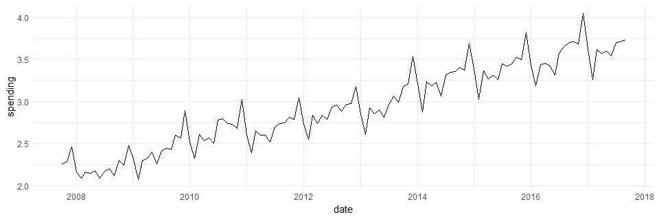
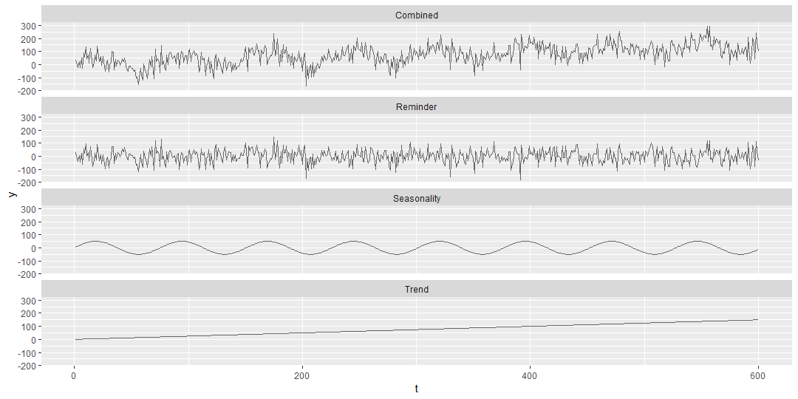
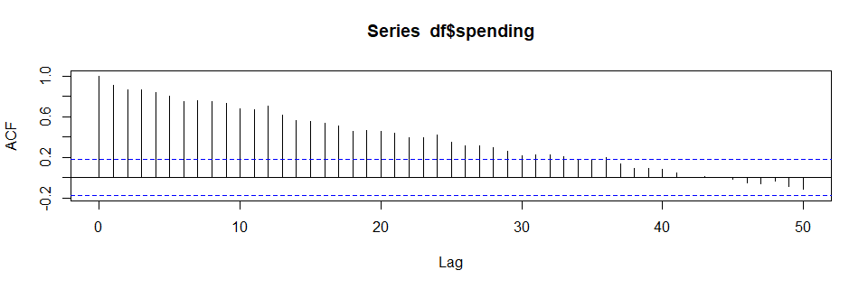

```{r setup, include=FALSE}
knitr::opts_chunk$set(echo = TRUE, fig.align="center")
```


# Summary

TODO


# Time-series

Time-series represents a series of data points over time. When modelling time-series we have to acknowledge that (to the best of our knowledge) time flows constantly in a single direction. We already talked about this briefly during the cross-validation lecture. There we learned that when performing cross-validation we have to be careful about how we split the data, if we do not split it correclty our models become clairvoyant and give too optimistic results on test sets. Below is an example time-series that visualizes how the amount of money spent in restaurants changed through time. The data is in billions of dollars for Australia.

<center>
  
</center>

Time-series ($y(t)$) can be trypically decomposed into three components, the trend, the seasonality and the reminder:

$$y(t) = t(t) + s(t) + r(t).$$

The trend component ($t(t)$) represents the general long-term change of the observed value with time. The seasonality component $s(t)$ describes short-term cycles in the time-series. The last component -- the reminder ($r(t)$) -- describes random variation in the signal. In the literature the reminder component is also sometimes called the error or the noise component. We believe this is not the best notation as this component is often not really noise or error, but the part of the time-series that we are unable to explain with our models. Note that not all time-series are composed of all three components, we often have time-series without a trend or without seasonality. There are also time-series that have neither the trend nor the seasonality component, these are called stationary time-series. We can usually find out what components are present in our time-series by exploring their autocorrelation.

# Autocorrelation

Autocorrelation represents the degree of similarity between a time-series and a lagged copy of the series (same series, delayed by a certain amount of time steps) over successive time intervals. Like previously mentioned autocorrelation is useful for determining whether a time-series has a trend or a seasonlity component. We can use the autocorrelation function (ACF, \texttt{acf()} in R) to inspect how autocorrelation changes with lag size and a visual inspection of ACF plots gives tells us what components are present in our time-series.

In this example, we build the three components (trend, seasonality and remined) of the time-series manually. We created a 600 data-points ($t \in [1,600]$) long series for each of the components. Trend was calculated as:

$$t(t) = t * 0.25$$,

seasonality as:

$$s(t) = sin(t/12) * 50$$,

and reminder as:

$$r(t) \sim N(0, 50).$$
The figure below visualizes these three components separately along with a combination of all three.

<center>
  
</center>

To inspect how ACF's can be used for better understading the componets of our series, we combined the above series in different combinations and used R's \texttt{acf()} function to calculate and plot their ACF's. Below is a visualization of various time-series component combinations.

<center>
  
</center>

The grey bars represent autocorrelation given a certain lag, while the dashed blue horizontal lines denote the -0.05 and 0.05 value of autocorrelation. A rule of thumb says that if the majority of autocorrelation values are inside the [-0.05, 0.05] interval then the time-series is stationary. As we can see a time-series without the seasonality and noise components is indeed stationary. The trend component can be observed as a steady increase or decline in the ACF as the lag increases, while the seasonality can be seen in sinus-like oscillations of ACF. If a a signal is composed of multiple components then the visual properties defining them are joined together. For example the ACF visualization with both trend and seasonality components has a decline in ACF as well as a sinusoidal component.

# Harmonic regression

Harmonic regression tries to decompose a given time-series into the three components mentioned above.

# Autoregressive (AR) and moving average (MA) models


# ARMA

ARMA(1,1)


# More advanced models

During this lecture we only scratched the surface of time-series modelling. To cover the topic thoroughly, we would require a whole course for it! This section provides some basic tips for possible paths to explore if you would require more advanced models.

An upgrade to the ARMA model is called ARIMA.

A further upgrade to the ARIMA model is called SARIMA.

Two alternative directions worth exploring that do not build upon ARMA models are Hidden Markov Models and Gaussian processes.

# References

* Esprabens J., Arango A., Kim J., (2020). Time Series for Beginners. (https://bookdown.org/JakeEsprabens/431-Time-Series/).

* Stan Documentation. (2021). Time-Series Models. (https://mc-stan.org/docs/2_21/stan-users-guide/time-series-chapter.html).

* UPenn. Time Series Analysis Course, Chapter 6 -- Harmonic Regression. (http://www-stat.wharton.upenn.edu/~stine/stat910/index.html).

* Wiki pages on AR, MA, ARMA, ARIMA.