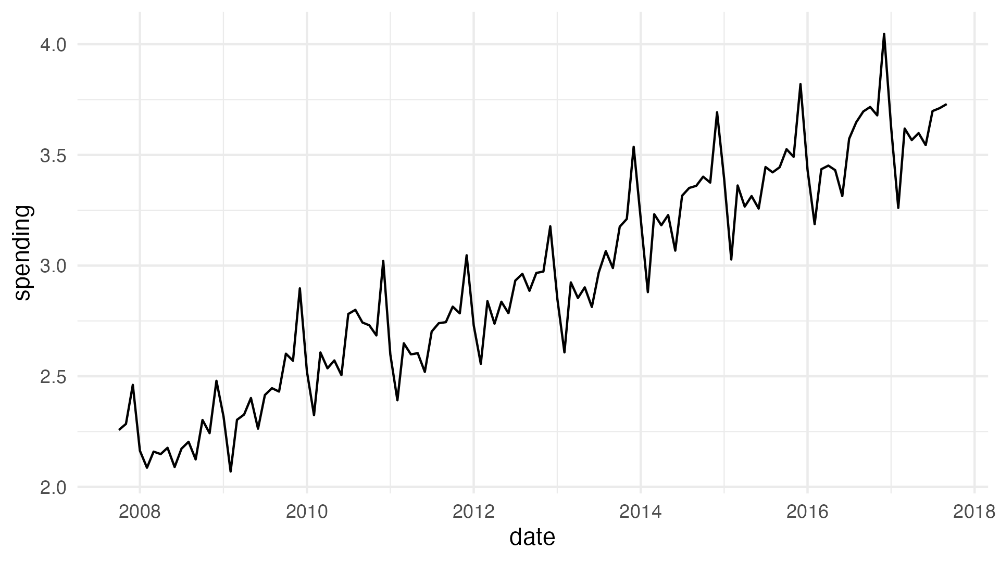
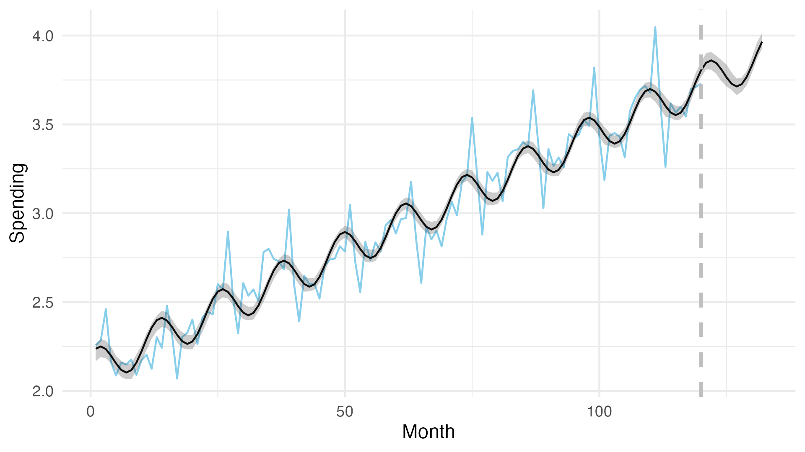
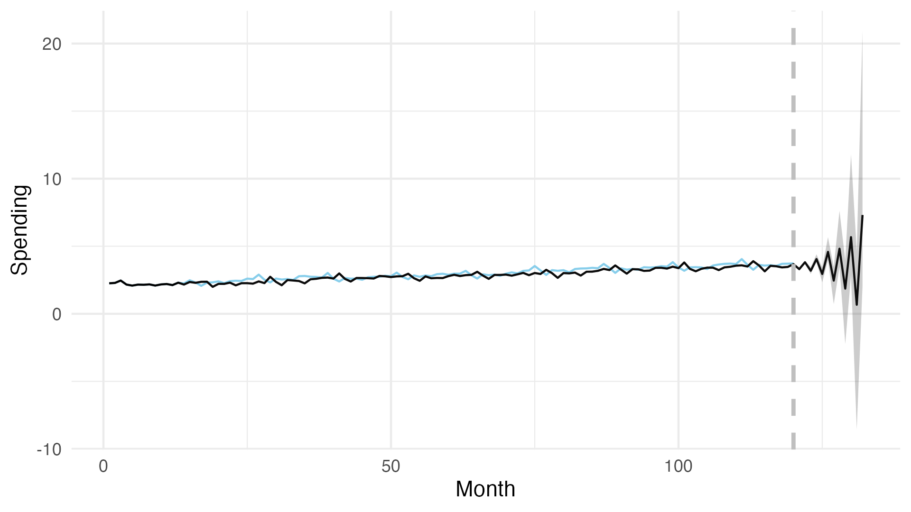

```{r setup, include=FALSE}
knitr::opts_chunk$set(echo = TRUE, fig.align="center")
```

# Summary

In this lecture we will learn about the basics of time-series modelling. We will first learn how to use harmonic regression to decompose a time-series into its subcomponents (trend, seasonality and remainder). By decomposing the time-series and looking at its components we can gain a better understanding of our data. Next, we will acknowledge the fact that past data can help us with predicting new data and build models that facilitate this finding. The models that do this are usually called auto-regressive and moving average models.

# Time-series

Time-series represents a series of data points over time. When modelling time-series we have to acknowledge that (to the best of our knowledge) time flows constantly in a single direction. We already talked about this briefly during the cross-validation lecture. There we learned that when performing cross-validation we have to be careful about how we split the data, if we do not split it correctly our models become clairvoyant and give too optimistic results on test sets. There is another important thing to consider when talking about time-series -- data points that are close in time are usually also close in value. Several approaches for modelling time-series are based on this claim. Below is an example time-series that visualizes how the amount of money spent in restaurants changed through time. The data is in billions of dollars for Australia.

<center>
  
</center>

We use the notation $y_t$ to denote the value of the time-series at time point $t$. Time-series can be typically decomposed into three components, the trend, the seasonality and the remainder:

$$y_t = t_t + s_t + r_t.$$

The trend component, $t_t$, represents the general long-term change of the observed value with time. The seasonality component, $s_t$, describes short-term cycles in the time-series. The last component -- the remainder, $r_t$ -- describes random variation in the signal. In the literature the remainder component is also sometimes called the error or the noise component. We believe this is not the best notation as this component is often not really noise or error, but the part of the time-series that we are unable to explain with our models. We can usually find out what components are present in our time-series by exploring their autocorrelation. Note that not all time-series are composed of all three components, we often have time-series without a trend or without seasonality, or even without both. A common term you might see in literature is stationary time-series, these are time-series whose mean, variance and autocorrelation do not change over time. Usually, this means that the time-series has no trend or seasonality.

# Autocorrelation

Autocorrelation represents the degree of similarity between a time-series and a lagged copy of the series (same series, delayed by a certain amount of time steps) over successive time intervals. Like previously mentioned autocorrelation is useful for determining whether a time-series has a trend or a seasonality component. We can use the autocorrelation function (ACF, *acf()* in R) to inspect how autocorrelation changes with lag size and a visual inspection of ACF plots gives tells us what components are present in our time-series. Autocorrelation, given some lag $k$ is calculated as:

$$ACF(k) = \frac{\sum_{t=k+1}^T(y_t - \bar{y})(y_{t-k} - \bar{y})}{\sum_{t=1}^T(y_t - \bar{y})^2},$$
where $y_t$ is the value of the time-series at time point $t$.

In this example, we build the three components (trend, seasonality and remainder) of the time-series manually. We created a 600 data-points ($t \in [1,600]$) long series for each of the components. Trend was calculated as:

$$t_t = t * 0.25,$$

seasonality as:

$$s_t = sin(t/12) * 50,$$

and remainder as:

$$r_t \sim N(0, 50).$$

The figure below visualizes these three components separately along with a combination of all three.

<center>
  
</center>

To inspect how ACF's can be used for better understanding the components of our series, we combined the above series in different combinations and used R's *acf()* function to calculate and plot their ACF's. Below is a visualization of various time-series component combinations.

<center>
  
</center>

The grey bars represent autocorrelation given a certain lag. A rule of thumb says that if the majority of autocorrelation values are close to 0 then the time-series is stationary. As we can see a time-series without the seasonality and noise components is stationary. The trend component can be observed as a steady increase or decline in the ACF as the lag increases, while the seasonality can be seen in sinus-like oscillations of ACF. If a signal is composed of multiple components then the visual properties defining them are joined together. For example the ACF visualization with both trend and seasonality components has a decline in ACF as well as a sinusoidal component.

# Partial autocorrelation

ACF is a simple (also called complete or total) correlation between the time-series and its copy lagged by $k$. Partial autocorrelation function (PACF) is different in one aspect as it finds the correlation of the residuals with the next lag value after removing the effects which are already explained by the earlier lags. In other words, before calculating PACF($k$), we take out the effect of all the previous lags (1, 2, ..., $k-1$) and work with residuals. So if there is any hidden information in the residual which can be modelled by the next lag, we might get a good correlation and we will keep that next lag as a feature while modelling.

More formally, PACF of time series $y_t$ is the autocorrelation between $y_t$ and $y_{t+k}$ with the linear dependence of $y_t$ on $y_{t+1}$ through $y_{t+k-1}$ removed. Equivalently, it is the autocorrelation between $y_t$ and $y_{t+k}$ that is not accounted for by lags 1 through $k-1$. It is usually calculated via the Durbin-Levinson algorithm. Interested readers can find more details in additional references of this lecture.

# Harmonic regression

Harmonic regression tries to decompose a given time-series into the three components mentioned above. The trend component is modelled as a linear function, the seasonality component is modelled with a sine and cosine function, while the remainder is normally distributed around the sum of the trend and seasonality components. Formally, harmonic regression is thus defined as:

$$y_t \; | \; t, \alpha, \beta, \beta_{cos}, \beta_{sin}, \omega, \sigma \sim N(t_t + s_t, \sigma),$$
$$t_t = \alpha + \beta * t,$$
$$s_t = \beta_{cos} \cos(\omega t) + \beta_{sin} \sin(\omega t).$$

$\alpha$ represents the intercept of the trend component, while $\beta$ is its beta coefficient. Note that the trend above is linear, in practice it could be anything (quadtratic, polynomial...), so you can swap the linear term in $t_t$ with something that works beeter for your data.

$\beta_{cos}$ and $\beta_{sin}$ represent beta coefficients for cosine and sine parts of the seasonality component. With $\omega$ we define the frequency of the seasonality component:

$$\omega = \frac{2 \pi}{M},$$

where $M$ represents the period of seasonality. For example, if our time-series has monthly measurements and has a yearly seasonality period we would set $M=12$, if we have weekly data and a yearly period we would set it to $M=52.25$, etc.

The seasonality component in the above model describes seasonality with only a single period, if the seasonality in our time-series is composed of multiple fluctuations we need a more complex model. We can easily upgrade the seasonality component to allow fluctiations with different values for the $\omega$ parameter:

$$s_t = \sum_{i=1}^k \beta_{cos,i} \cos(\omega_i t) + \beta_{sin,i} \sin(\omega_i t).$$

Above, the seasonality component is now a sum of multiple sub-components, each of them has its own period (defined through $\omega_i$) and each own beta coefficients. The simple model implemented in Stan can be found in the *harmonic_basic.stan* model file, while the upgraded model is implemented in *harmonic.stan* file, you can find both in the official repository for this course.

Sometimes we do not know exactly what the period of seasonality in our time-series is. We can investigate the frequencies using traditional signal analysis techniques, such as FFT (fast Fourier transform) and the power spectrum plot. The power spectrum plot shows us which frequencies are dominant in our time-series and we can use this information to calculate the value of $M$. The power spectrum plot below is calculated on the average monthly temperature data in Slovenia.

<center>
  
</center>

As you can see the seasonality in this dataset is dominated by a single frequency ($0.08\overline{3}$), this frequency represents the yearly trend in temperature. The measurements in our dataset are monthly, so a yearly seasonality has a frequency of $\frac{1}{12} = 0.08\overline{3}$.

In this example of harmonic regression we will use the restaurants spending time-series. The time-series describes how spending (in billions of dollars) changed over time in Australia. The visualization of it can be found in the top portion of the figure below. We used the harmonic regression where seasonality component has a single frequency, the period we used for the seasonality components was 12 months ($M=12$). Diagnostics show no reasons for concern, so we can proceed with our analysis. Below is a visualization of the decomposition results.

<center>
  
</center>

We can see that spending has a growing trend, this means that people spend more and more money in restaurants. Note that the data is not adjusted for inflation, so the growth is probably a bit misleading and too big. We can see that the remainder component is still quite strong, meaning that this simple model is unable to explain a lot of what is going on. We can also see that the model found a well fitting yearly seasonality component. Below is a visualization of the model against the underlying data.

<center>
  
</center>

There are two other harmonic regression examples in the repository. The first one (*temperature.R*) uses the monthly average Slovenian temperature data. There we first use FFT to find the dominant frequency in the time-series and then execute harmonic regression to decompose it. The second one (*O2.R*}) uses a dataset about the concentration of oxygen ($O_2$) in the air. This example illustrates how you can model the seasonality component that is composed of several frequencies.

# Autoregressive (AR) and moving average (MA) models

The autoregressive (AR), moving average (MA) and their combinations or derivatives are probably the most popular models when it comes to modelling time-series. AR and MA as well as their combination (ARMA) are not suitable for modelling non-stationary time-series. When modelling such time-series you usually need to use more advanced models from this family (ARIMA, SARMA, SARIMA). An alternative approach is to first detrend and deseasonalize the data and then work on the remainder. Detrending or deseasonalizing means removing the trend and seasonality components from the time series (e.g., with harmonic regression) and then working on the remainder with a model that is suitable for that task.

## The autoregressive model (AR)

AR uses observations from previous time steps as input to a regression in order to predict the value at the next step. The $p$ parameter determines the order of the autoregressive model, the order represents the amount of time steps used in the regression. We can formally define the AR($p$) model as:

$$y_t \; | \; t, p, \alpha, \beta, \sigma \sim N \left( \alpha + \sum_{i=1}^p \beta_i y_{t-i}, \sigma \right).$$
So the model is relatively simple, a regression model with an intercept $\alpha$ which takes into account the previous $p$ data points in the time-series and assigns a beta coefficient to each of these points. The noise is normally distributed around the regression line with variance $\sigma$. In order to better understand models that have varying complexity (complexity is defined with a parameter) it is usually best if you take a look at the simplest case. In our case this is the AR(1) model:

$$y_t \; | \; t, \alpha, \beta, \sigma \sim N \left( \alpha + \beta y_{t-1}, \sigma \right).$$
As you can see this is essentially a very simple regressive model that uses a single beta coefficient to determine the amount of influence the previous time point has on the current one.

We usually determine the order ($p$) of the autoregressive model by looking at the the partial autocorrelation function (PACF). ACF is not suitable because in autoregressive processes, previous time points also have an indirect impact on the current time point, which means that even with an AR(1) process, autocorrelation will still be relatively high for lags larger than 1. PACF does not have this problem as it removes the indirect effects, which is why we can use it to determine the order of an autoregressive model. Below is the PACF plot for our time-series.

<center>
  
</center>

Black vertical lines denote the value of PACF given some lag while the dashed blue lines denote the 95\% CI, if a line sticks out of the blue lines we can say with high confidence that PACF at that lag is different than 0. We can see that the last value for which we can confidently say is not zero is at lag 13. Note here that we usually treat $p$ as a hyper-parameter and try a couple of options for it. PACF is a good starting point to get a set of plausible options. Some alternative options worth exploring based on the visualization above could be 3, 6, 7, 10.

Based on the above we set the $p$ parameter of our model to 13 and fit the model. Diagnostics show no reasons for concern. Below is a visualization of model's fit against the underlying data.

<center>
  
</center>

At a glance, the model's fit looks quite good, but we can see that it does not do a good job for forecasting future values. At least for predictions that are farther in the future. AR models have problems with non-stationary time-series so this is a somewhat expected results. An important thing to note here is also that the quality of predictions is declining and the uncertainty is growing as we move into the future. This makes sense, the farther into the future the data point we are trying to predict is, the harder the task. Another reason for this is that, the AR model is making future predictions based on past values, once past values become predictions themselves the quality of predictions usually declines heavily.

It is important to establish that we do not have to use all the from 1 to $n$. Let's say we have weekly data and the value at the current time point ($y_t$) is dependent only on the data from 2 weeks and 4 weeks back. Such autoregressive model would have the following formulation:

$$y_t \; | \; t, \alpha, \beta_1, \beta_2, \sigma \sim N \left( \alpha + \beta_1 y_{t-2} + \beta_2 y_{t-4}, \sigma \right).$$
You can see that we skipped two timepoints in our modelling ($y_{t-1}$ and $y_{t-3}$) since they are not relevant for the prediction of the current time point.

An upgrade to the AR model is ARX (autoregressive model with exogenous variables). Again, the upgrade is relatively simple:

$$y_t \; | \; t, p, s, \alpha, \beta, \theta, \sigma \sim N \left( \alpha + \sum_{i=1}^p \beta_i y_{t-i} + \sum_{j=1}^s \theta_j x_{t-j}, \sigma \right),$$
where $\theta_j$ is the regression coefficient for the exogenous variable $x_j$, which can be constant through time or can change with it as in the equation above.

Another upgrade to the AR model is called VAR (multivariate autoregressive model), we will only mention it here as it is relatively complex and probably out of scope for Bayesian Statistics 101 lectures. Like mentioned, there are whole courses dedicated to time series modelling while we only scratch the surface in a single lecture, so we have to stop somewhere.

## The moving average model (MA)

MA specifies that the output variable depends linearly on the current and various past values of a stochastic term. It accounts for very short-run autocorrelation, and is as such not suitable for time-series where ACF is high for large values of lag. We can formally define the MA($q$) model as:

$$y_t \; | \; t, q, \mu, \theta, \sigma, \sim N(\mu + \sum_{i=1}^q \theta_i \epsilon_{t-i}, \sigma),$$

$$\epsilon_1 = y_1 - \mu,$$

$$\epsilon_2 = y_2 - (\mu + \theta_1 \epsilon_1),$$

$$...$$

$$\epsilon_t = y_t - (\mu + \sum_{i=1}^q \theta_i \epsilon_{t-i}).$$
Above, $\mu$ denotes the mean of the series, $\theta_i$ are the model's parameters (error coefficients) and $\epsilon_t$ is the white noise (remainder) at time point $t$. Just like in the case of AR, let us take a look at the MA(1) model:

$$y_t \; | \; t, q, \mu, \theta, \sigma \sim N(\mu + \theta \epsilon_{t-1}, \sigma).$$

With MA we are modelling the time-series with its average ($\mu$) and errors. In the error modelling part, $y_{t-1} - \mu$ represents the error in the previous time step, while $\theta_1$ is the error coefficient that determines how previous errors influence the error at the current point in time.

To better understand how the model works let us apply it on an illustrative example. Each week the professor wants to bring a cookie for each student at the lectures. The professor wants to bring the exactly right amount of cookies each weak and will use the MA(1) model to calculate the amount of cookies for next week. The average number of students at lectures is 15 ($\mu = 15$), the professor will give the weight of 0.5 to previous error ($\theta = 0.5$), thus professor's model becomes:

$$y_t = 15 + 0.5 \epsilon_{t-1}.$$
The table below visualizes how the professor applies this model to calculate the amount of cookies for next week's lectures:

| Lecture | No. students | No. cookies              | Error |
|---------|--------------|--------------------------|-------|
| 1       | 17           | 15 ($\mu$)               | 2     |
| 2       | 12           | 15 + 0.5 $\cdot$ 2 = 16  | -4    |
| 3       | 13           | 15 + 0.5 $\cdot$ -4 = 13 | 0     |
| 4       | 19           | 15 + 0.5 $\cdot$ 0 = 15  | 4     |
| ...     | ...          | ...                      | ...   |

The first week, the professor brings 15 cookies, which is equal to the $\mu$ parameter. The professors has no information about previous errors so the mean is a good starting point. Since there are 17 students at the lectures, 2 of them did not get a cookie. The professors then uses this error to adjust the amount of cookies for the next lectures. Based on this error and the $theta$ parameter, professor brings 16 cookies to the second lecture. Since only 12 students attended, the professors brought 4 cookies too much. Again, the professors takes notice of this error and uses it to calculate next week's amount of cookies. You can see that the MA(1) model uses only the previous error, the MA(2) model for example would use two previous errors.

To define a suitable value for the $q$ parameter, we usually take a look at the the ACF plot. Suitable values are those, where we can say with high confidence that the ACF value is not significant any more. Below is the ACF plot for our time-series.

<center>
  
</center>

Based on this plot a suitable value for $q$ would be around 35. Note that this number is way too high and would probably cause all kinds of problems, such as over-fitting and issues with convergence. Based on the above visualization MA model is most likely not suitable for modelling our time-series. For illustrative purposes we decided to use a value 12 for the $q$ parameter. Below is a visualization of this model's fit.

<center>
  
</center>

At a glance, the model's fit looks quite good, we can see that the model also seems to do better at predicting future values than the AR model. This is somewhat surprising as we saw that our dataset is not the best fit for the MA model since it has a high autocorrelation even with higher lags. Note that the model would still most likely fail spectaculary if we tried to predict points that are further in the future. And to properly compare models we would have to execute CV and compare them properly.

## ARMA

Like the name suggests ARMA (Autoregressive Moving Average Model) is a combination of the previous two approaches. Putting it all together, ARMA($p$,$q$), which is a combination of AR($p$) and MA($q$) formally looks like this:

$$\epsilon_t \; | \; \sigma \sim N(0, \sigma),$$

$$\epsilon_t = y_t - (\mu + ar_t + ma_t) ,$$

where $\epsilon$ represents the error term, $\mu$ the mean parameter, $ar$ the autoregressive component and $ma$ the moving average component. The autoregressive component is calculated as:

$$ar_t = \sum_{i=1}^p \beta_i y_{t-i}.$$

The moving average component on the other hand is calculated as:

$$ma_t = \sum_{i=1}^q \theta_i \epsilon_{t-i}.$$

Let us again take a look at the simplest ARMA case, ARMA(1,1):

$$\epsilon_1 = y_1 - \mu,$$

$$\epsilon_t = y_t - (\beta y_{t-1} + \theta \epsilon_{t-1}).$$

Essentially, the $\mu$ parameter from the MA model is replaced with the $ar_t$ component. So we use AR to model the mean and MA to model the errors. Below is a visualization of an ARMA model fit against our data. Here, we used the same values for $q$ and $p$ parameters as before, so we used an ARMA(13,12) model. Note that this model is quite complex so it took some additional effort to get it to fit properly. After setting the $p$ and $q$ parameters we had to configure various parameters (e.g., *max_treedepth* and *adapt_delta*) of the fitting process. If this still does not help, the next step is to provide better priors that would help the sampler out. Below is a visualization of this fit along with some future predictions.

<center>
  
</center>

# More advanced models

During this lecture we only scratched the surface of time-series modelling. To cover the topic thoroughly, we would probably require a whole course for it! This section provides some basic tips for possible paths to explore if you would require more advanced models.

As we saw AR, MA and ARMA are not suitable for modelling non-stationary time-series. An upgraded model that partially solves this called ARIMA, which stands for autoregressive integrated moving average model. ARIMA is a generalization to the ARMA model and comes in handy for non-stationary time-series with a trend. ARIMA it tries to make the data stationary by removing the trend. Similarly, SARMA tries to remove the seasonality from a non-stationary time-series before modelling it. The final model, SARIMA, tries to make the time-series stationary by removing both the trend and the seasonality components. Since the time-series we used during this lectures have both a trend and a seasonality component, we would probably need to use a SARIMA model to get a good model.

There are also alternative approaches that do not fall into the category of AR or MA models. Two alternative directions worth exploring in this direction are Hidden Markov Models and Gaussian processes.

# References

* Esprabens J., Arango A., Kim J., (2020). Time Series for Beginners. (<https://bookdown.org/JakeEsprabens/431-Time-Series/>).

* Stan Documentation. (2021). Time-Series Models. (<https://mc-stan.org/docs/2_21/stan-users-guide/time-series-chapter.html>).

* UPenn. Time Series Analysis Course, Chapter 6 -- Harmonic Regression. (<http://www-stat.wharton.upenn.edu/~stine/stat910/index.html>).

* Wiki pages on Autocorrelation, Partial autocorrelation, AR, MA, ARMA, ARIMA.
